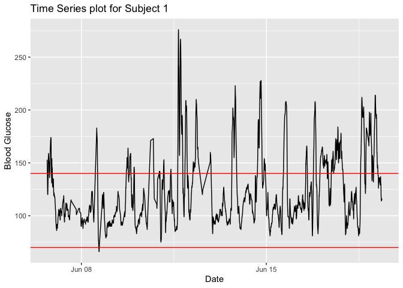
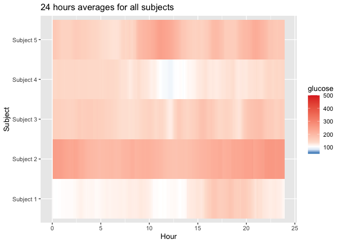

<!-- README.md is generated from README.Rmd. Please edit that file -->

# iglu

<!-- badges: start -->

[](https://travis-ci.com/github/irinagain/iglu)
[](https://ci.appveyor.com/project/irinagain/iglu)

[](http://cran.rstudio.com/web/packages/iglu/index.html)
<!-- badges: end -->

# iglu: Interpreting data from Continuous Glucose Monitors (CGMs)

The R package ‘iglu’ provides functions for outputting relevant metrics
for data collected from Continuous Glucose Monitors (CGM). For
reference, see [“Interpretation of continuous glucose monitoring data:
glycemic variability and quality of glycemic control.” Rodbard
(2009)](https://www.ncbi.nlm.nih.gov/pubmed/19469679).

iglu comes with two example datasets: example\_data\_1\_subject and
example\_data\_5\_subject. These data are collected using Dexcom G4 CGM
on subjects with Type II diabetes. Each dataset follows the structure
iglu’s functions are designed around. Note that the 1 subject data is a
subset of the 5 subject data. See the examples below for loading and
using the data.

## Installation

``` r
# Plain installation
devtools::install_github("irinagain/iglu") # iglu package

# For installation with vignette
devtools::install_github("irinagain/iglu", build_vignettes = TRUE)
```

## Example

``` r
library(iglu)
data(example_data_1_subject) # Load single subject data
## Plot data

# Use plot on dataframe with time and glucose values for time series plot
plot_glu(example_data_1_subject)
```



``` r

# Summary statistics and some metrics
summary_glu(example_data_1_subject)
#> # A tibble: 1 x 7
#> # Groups:   id [1]
#>   id         Min. `1st Qu.` Median  Mean `3rd Qu.`  Max.
#>   <fct>     <dbl>     <dbl>  <dbl> <dbl>     <dbl> <dbl>
#> 1 Subject 1    66        99    112  124.       143   276

in_range_percent(example_data_1_subject)
#> # A tibble: 1 x 4
#>   id        in_range_70_140 in_range_70_180 in_range_80_200
#>   <fct>               <dbl>           <dbl>           <dbl>
#> 1 Subject 1            73.7            91.7            96.0

above_percent(example_data_1_subject, targets = c(80,140,200,250))
#> # A tibble: 1 x 5
#>   id        above_140 above_200 above_250 above_80
#>   <fct>         <dbl>     <dbl>     <dbl>    <dbl>
#> 1 Subject 1      26.7      3.70     0.446     99.4

j_index(example_data_1_subject)
#> # A tibble: 1 x 2
#>   id        j_index
#>   <fct>       <dbl>
#> 1 Subject 1    24.6

conga(example_data_1_subject)
#> # A tibble: 1 x 2
#>   id        conga
#>   <fct>     <dbl>
#> 1 Subject 1  37.0

# Load multiple subject data
data(example_data_5_subject)

plot_glu(example_data_5_subject, plottype = 'lasagna', datatype = 'average')
```



``` r

below_percent(example_data_5_subject, targets = c(80,170,260))
#> # A tibble: 5 x 4
#>   id        below_170 below_260 below_80
#>   <fct>         <dbl>     <dbl>    <dbl>
#> 1 Subject 1      89.6      99.7    0.652
#> 2 Subject 2      17.7      78.9    0    
#> 3 Subject 3      73.5      96.0    0.913
#> 4 Subject 4      91.8     100      2.05 
#> 5 Subject 5      55.3      90.3    1.13

mage(example_data_5_subject)
#> # A tibble: 5 x 2
#>   id         mage
#>   <fct>     <dbl>
#> 1 Subject 1  53.4
#> 2 Subject 2  78.2
#> 3 Subject 3  76.6
#> 4 Subject 4  42.9
#> 5 Subject 5  90.0
```

## Shiny Demonstration

For a demonstration of the package in a point and click interface, click
the link below.

<https://stevebroll.shinyapps.io/shinyigludemo/>
