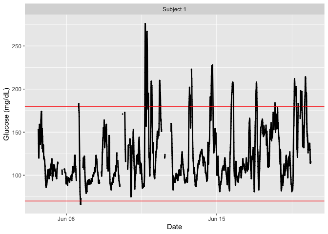

<!-- README.md is generated from README.Rmd. Please edit that file -->

# iglu

<!-- badges: start -->

<!-- badges: end -->

# iglu: Interpreting data from Continuous Glucose Monitors (CGMs)

The R package ‘iglu’ provides functions for outputting relevant metrics
for data collected from Continuous Glucose Monitors (CGM). For
reference, see [“Interpretation of continuous glucose monitoring data:
glycemic variability and quality of glycemic control.” Rodbard
(2009)](https://www.ncbi.nlm.nih.gov/pubmed/19469679).

iglu comes with two example datasets: example\_data\_1\_subject and
example\_data\_5\_subject. Each dataset follows the structure iglu’s
functions are designed around. Note that the 1 subject data is a subset
of the 5 subject data. See the examples below for loading and using the
data.

## Installation

``` r
# Plain installation with dependency 

devtools::install_github('swihart/lasagnar') # for lasagna plots (multi subject)
devtools::install_github("stevebroll/iglu") # iglu package


# For installation with vignette
devtools::install_github("stevebroll/iglu", build_vignettes = TRUE)
```

## Example

``` r
library(iglu)
data(example_data_1_subject) # Load single subject data
## Plot data

# Use plot on dataframe with time and glucose values for time series plot
plot_glu(example_data_1_subject)
```



``` r

# Summary statistics and some metrics
summary_glu(example_data_1_subject)
#>           Min. 1st Qu. Median     Mean 3rd Qu. Max.
#> Subject 1   66      99    112 123.6655     143  276

in_range_percent(example_data_1_subject)
#>           in_range_80_200 in_range_70_180 in_range_70_140
#> Subject 1        96.02058        91.66381        73.72213

above_percent(example_data_1_subject, targets = c(80,140,200,250))
#>           above_80 above_140 above_200 above_250
#> Subject 1 99.41681  26.68954  3.704974 0.4459691

j_index(example_data_1_subject)
#>            j_index
#> Subject 1 24.62815

conga(example_data_1_subject)
#>              conga
#> Subject 1 36.86259

# Load multiple subject data
data(example_data_5_subject)

below_percent(example_data_5_subject, targets = c(80,170,260))
#>           below_80 below_170 below_260
#> Subject 1 0.651801  89.57118  99.72556
#> Subject 2 0.000000  17.74479  78.93248
#> Subject 3 0.913242  73.51598  95.95564
#> Subject 4 2.046943  91.81223 100.00000
#> Subject 5 1.128205  55.28205  90.25641

mage(example_data_5_subject)
#>               mage
#> Subject 1 53.36908
#> Subject 2 78.16610
#> Subject 3 76.64453
#> Subject 4 42.91182
#> Subject 5 89.97086
```

## Shiny Demonstration

For a demonstration of the package in a point and click interface, click
the link below.

<https://stevebroll.shinyapps.io/shinyigludemo/>
