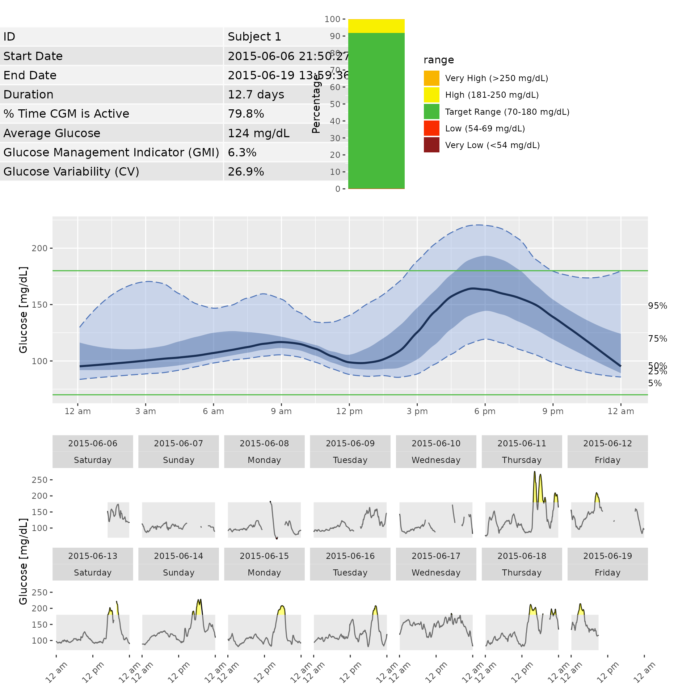
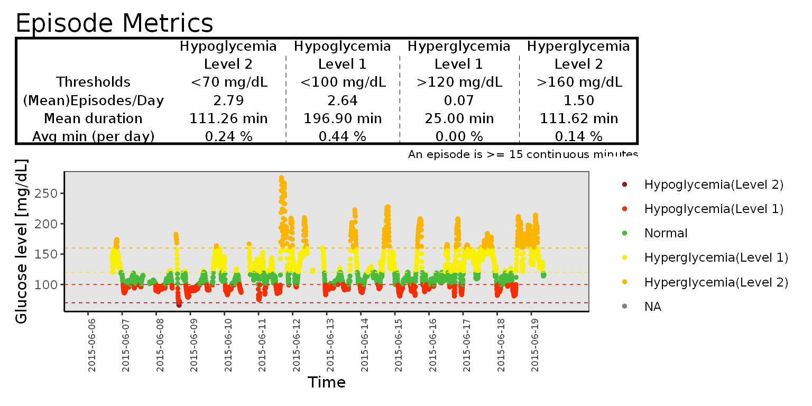

# AGP and Episodes

The iglu package includes two single page reports - an ambulatory
glucose profile (AGP), and an episode calculation report.

## Ambulatory Glucose Profile (AGP)

The iglu package allows one to generate an Ambulatory Glucose Profile
(AGP) report - see [Johnson (2019) “Utilizing the ambulatory glucose
profile to standardize and implement continuous glucose monitoring in
clinical practice.”](https://doi.org/10.1089/dia.2019.0034). Below is an
example report for Subject 1, which includes information on data
collection period, time spent in standardized glycemic ranges (cutoffs
of 54, 70, 180 and 250 mg/dL) displayed as a stacked bar chart, glucose
variability as measured by %CV, and visualization of quantiles of the
glucose profile across days together with daily glucose views.

``` r

agp(example_data_1_subject)
#> Warning: Using `size` aesthetic for lines was deprecated in ggplot2 3.4.0.
#> ℹ Please use `linewidth` instead.
#> ℹ The deprecated feature was likely used in the iglu package.
#>   Please report the issue at <https://github.com/irinagain/iglu/issues>.
#> This warning is displayed once per session.
#> Call `lifecycle::last_lifecycle_warnings()` to see where this warning was
#> generated.
```



### Episode Calculation

The episode_Calculation function measures the number of hypoglycemia and
hyperglycemia episodes or events.

``` r

episode_calculation(example_data_1_subject,lv2_hypo = 70, lv1_hypo = 120, lv2_hyper = 180, dur_length = 15)
#> # A tibble: 7 × 7
#>   id        type  level  avg_ep_per_day avg_ep_duration avg_ep_gl total_episodes
#>   <fct>     <chr> <chr>           <dbl>           <dbl>     <dbl>          <dbl>
#> 1 Subject 1 hypo  lv1            3.33             257.      105.              37
#> 2 Subject 1 hypo  lv2            0.0899            35        68.6              1
#> 3 Subject 1 hypo  exten…         1.71             437.      101.              19
#> 4 Subject 1 hyper lv1            1.44              80.3     200.              16
#> 5 Subject 1 hyper lv2            1.44              80.3     200.              16
#> 6 Subject 1 hypo  lv1_e…         3.24             262.      105.              36
#> 7 Subject 1 hyper lv1_e…         0                  0        NA                0
```

In this example, example_data_1_subject contains multiple days, and
episode_calculation function calculate the episodes across all days.

#### Parameters

##### data

DataFrame object with column names “id”, “time”, and “gl”.

##### lv1_hypo, lv2_hypo, hy1_hyper, lv2_hyper

Users can set certain thresholds for the hypo and hyperglycemia by
passing parameters, lv1_hypo, lv2_hypo, lv1_hyper, lv2_hyper. Level 2
indicates more severe states than level 1 so the threshold value for the
lv2_hypo value should be lower than lv1_hypo value, and the threshold
for the lv2_hyper value should higher than lv1_hyper value.

##### dur_length

By setting a duration length to 15 minutes (the last parameter), the
function will count the number of episodes that glucose values go below
or above the thresholds more than 15 minutes.

#### Return value

The function returns a dataframe for average number of episodes, average
episode duration, and average glucose in episodes. Optionally, the
function can return the input data with interpolation and episode
labeling added.

### Epicalc_profile function

Visualization of the metrics produced by the
[`episode_calculation()`](https://irinagain.github.io/iglu/reference/episode_calculation.md)
function is done with the function
[`epicalc_profile()`](https://irinagain.github.io/iglu/reference/epicalc_profile.md).
This function takes the
[`episode_calculation()`](https://irinagain.github.io/iglu/reference/episode_calculation.md)
output and displays it as a tables of the episode metrics as well as
plots that visualizes the subject’s episodes. This function is designed
to work with one subject data at a time, and the structure of the
function output is shown below.

``` r

epicalc_profile(example_data_1_subject)
```


