# Lasagna Plots in iglu

The `plot_glu` function supports lasagna plots by changing the
‘plottype’ parameter. For more on lasagna plots, see [Swihart et
al. (2010) “Lasagna Plots: A Saucy Alternative to Spaghetti
Plots.”](https://doi.org/10.1097/ede.0b013e3181e5b06a). The lasagna
plots in iglu can be single-subject or multi-subject. The single-subject
lasagna plot has rows corresponding to each day of measurements with a
color grid indicating glucose values.

The highest glucose values are displayed in red, whereas the lowest are
displayed in blue. Thus, the numerical glucose values are mapped to
color using the gradient from blue to red, which corresponds to the
default ‘blue-red’ color scheme. An alternative ‘red-orange’ color
scheme can be selected by the user by corresponding modification of the
‘color_scheme’ parameter.

``` r

library(iglu)
```

``` r

plot_glu(example_data_1_subject, plottype = 'lasagna', datatype = "single", tz = 'EST')
```

    ## Warning: Removed 14 rows containing missing values or values outside the scale range
    ## (`geom_tile()`).


``` r

plot_glu(example_data_1_subject, plottype = 'lasagna', datatype = "single", color_scheme = "red-orange", tz = 'EST')
```

    ## Warning: Removed 14 rows containing missing values or values outside the scale range
    ## (`geom_tile()`).

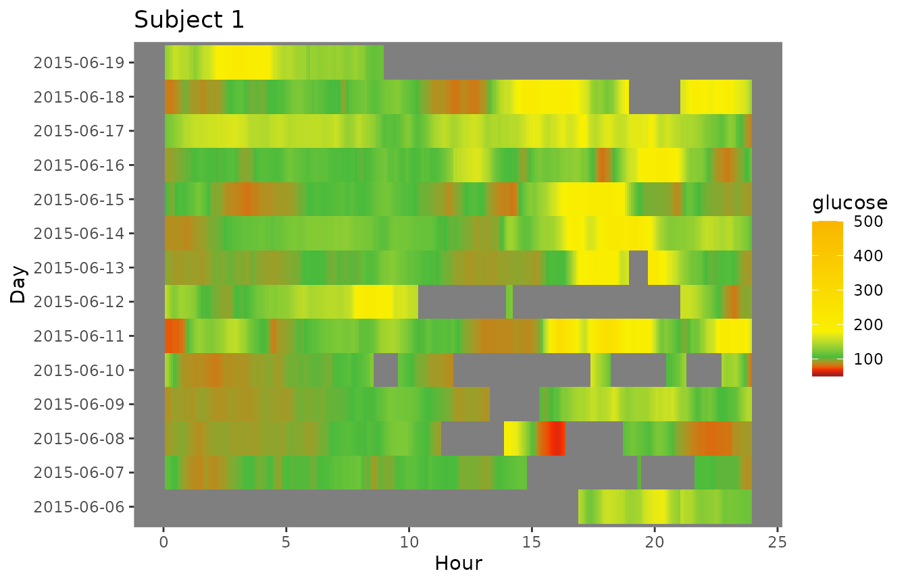

For plots with a single subject, setting the datatype parameter to
“single” will display a plot where the rows represent days.

``` r

plot_glu(example_data_1_subject, datatype = 'single', plottype = 'lasagna', tz = 'EST')
```

    ## Warning: Removed 14 rows containing missing values or values outside the scale range
    ## (`geom_tile()`).

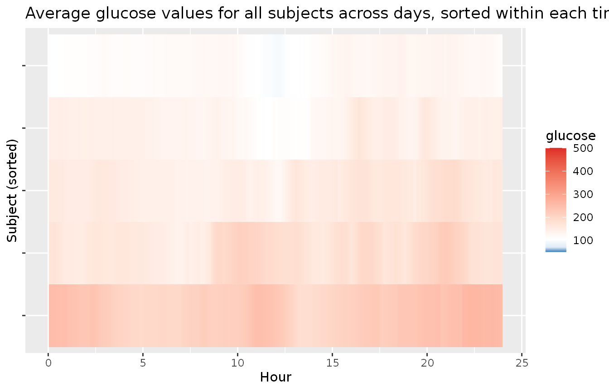

We can additionally sort the values at each time point by setting
`lasagnatype = 'timesorted'`

``` r

plot_glu(example_data_1_subject, plottype = 'lasagna', datatype = 'single', lasagnatype = 'timesorted', tz = 'EST')
```

    ## Warning: Removed 14 rows containing missing values or values outside the scale range
    ## (`geom_tile()`).


To average across days at each time point, we can use
`datatype = 'average'`:

``` r

plot_glu(example_data_1_subject, plottype = 'lasagna', datatype = 'average', tz = 'EST')
```

    ## Warning: Removed 1 row containing missing values or values outside the scale range
    ## (`geom_tile()`).

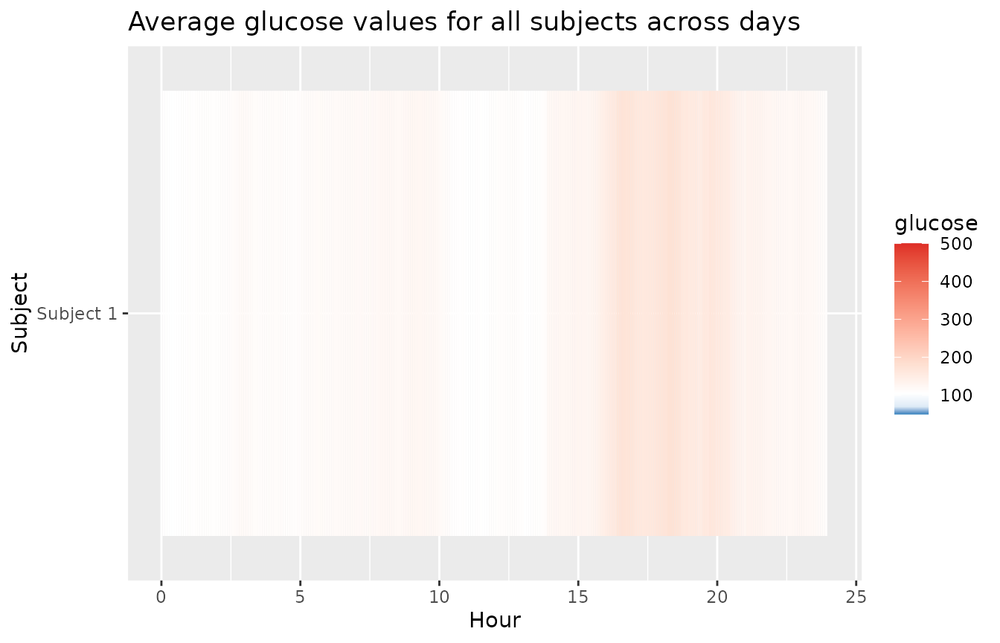

You can also produce plots for multiple subjects, by using data with
multiple values for “id”. By default, this will produce an unsorted
lasagna plot using up to 14 days worth of data with each subject
displayed in separate rows.

``` r

plot_glu(example_data_5_subject, plottype = 'lasagna', tz = 'EST')
```

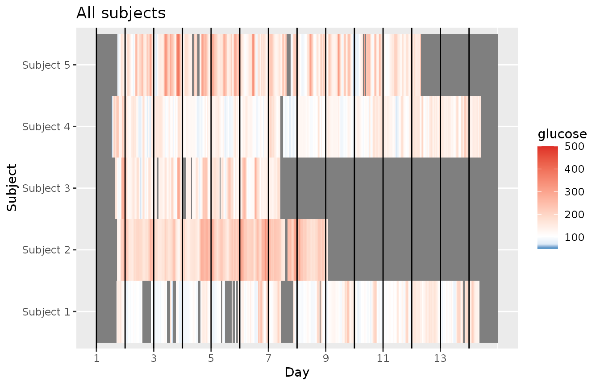

This works for all the above options sans datatype = single.

``` r

plot_glu(example_data_5_subject, plottype = 'lasagna', color_scheme = "red-orange", tz = 'EST')
```

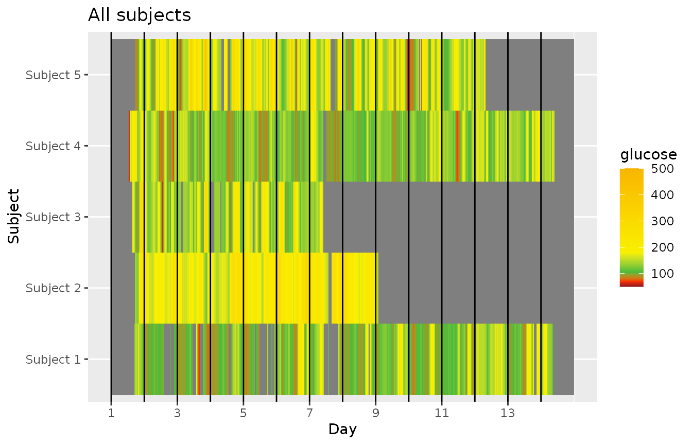

``` r

plot_glu(example_data_5_subject, plottype = 'lasagna', lasagnatype = 'timesorted', tz = 'EST')
```

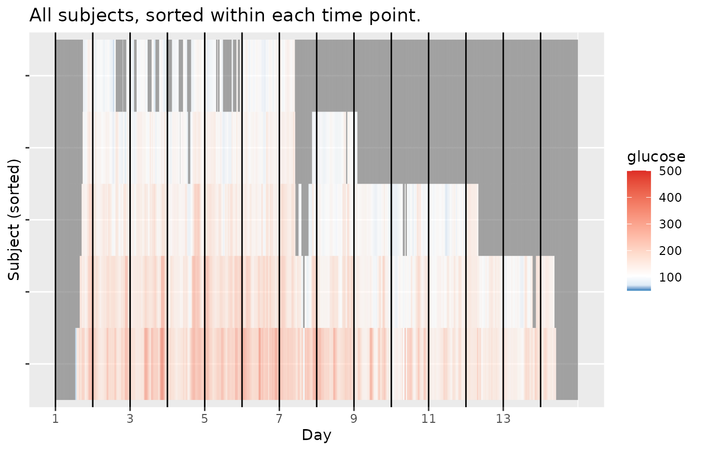

``` r

plot_glu(example_data_5_subject, plottype = 'lasagna', datatype = 'average', tz = 'EST')
```

    ## Warning: Removed 5 rows containing missing values or values outside the scale range
    ## (`geom_tile()`).

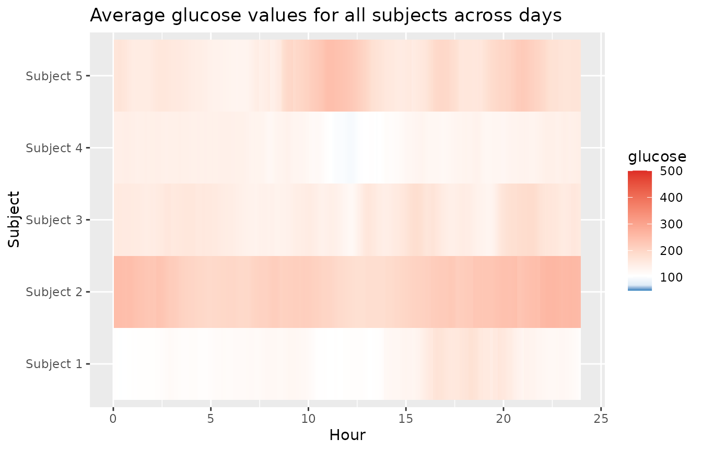

Lasagna plots are also an excellent way to visualize gaps in data. The
inter_gap parameter controls the maximum length of time (in minutes)
between glucose readings for interpolation to occur between them. See
how more gaps appear in the plot below as inter_gap shrinks.

``` r

plot_glu(example_data_1_subject, plottype ="lasagna", datatype = "single", inter_gap = 150)
```

    ## Warning: Removed 14 rows containing missing values or values outside the scale range
    ## (`geom_tile()`).

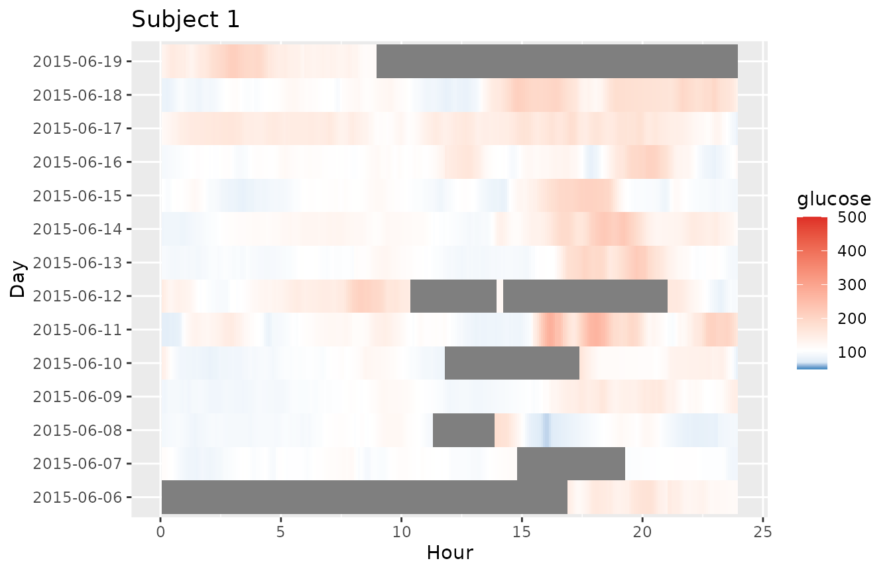

``` r

plot_glu(example_data_1_subject, plottype ="lasagna", datatype = "single", inter_gap = 45)
```

    ## Warning: Removed 14 rows containing missing values or values outside the scale range
    ## (`geom_tile()`).


``` r

plot_glu(example_data_1_subject, plottype ="lasagna", datatype = "single", inter_gap = 15)
```

    ## Warning: Removed 14 rows containing missing values or values outside the scale range
    ## (`geom_tile()`).

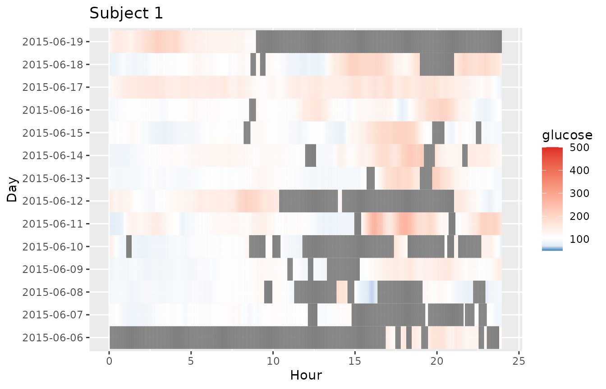

For further customization of lasagna plots, use the `plot_lasagna` and
`plot_lasagna_1subject` functions.

Within plot_lasagna, the “midpoint” parameter specifies the glucose
value (in mg/dL) at which the color transitions from blue to red (the
default is 105 mg/dL), and the “limit” parameter specifies the range
(the default is \[50, 500\] mg/dL)

``` r

plot_lasagna(example_data_5_subject, datatype = "average", midpoint = 140, limits = c(60,400), tz = 'EST')
```

    ## Warning: Removed 5 rows containing missing values or values outside the scale range
    ## (`geom_tile()`).

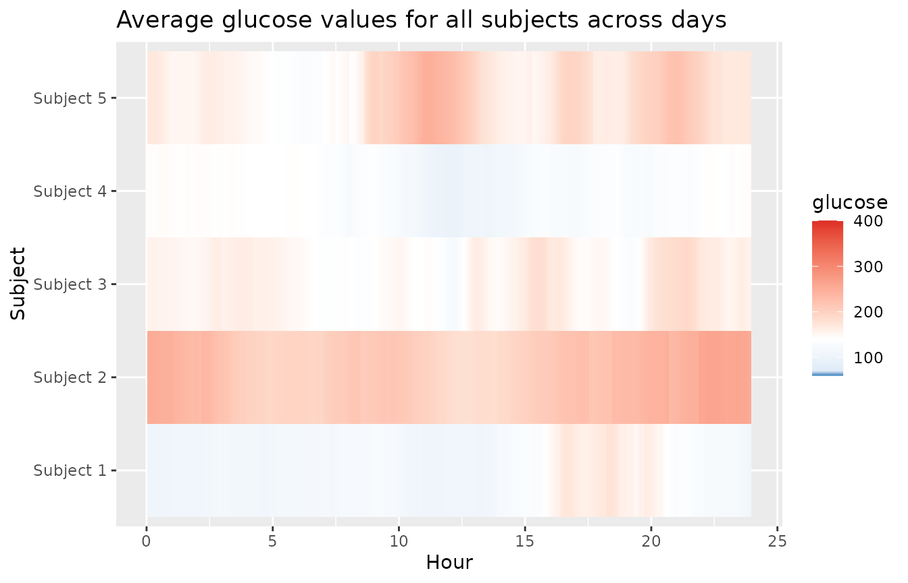

`plot_lasagna` allows for multi-subject lasagna plots with the
additional options of sorting the hours by glucose values for each
subject, i.e. horizontal sorting, by setting
`lasagnatype = 'subjectsorted'`.

``` r

plot_lasagna(example_data_5_subject, datatype = 'average', lasagnatype = 'subjectsorted', tz = 'EST')
```

    ## Warning: Removed 5 rows containing missing values or values outside the scale range
    ## (`geom_tile()`).

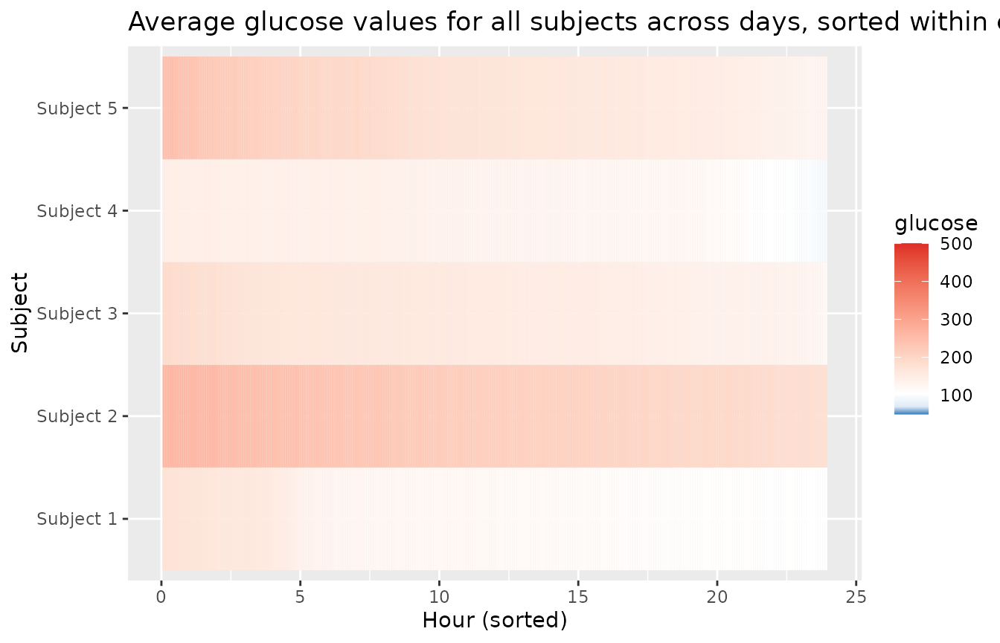

`plot_lasagna` also supports changing the maximum number of days to
display, as well as the upper and lower target range limits (LLTR and
ULTR), midpoint, and minimum and maximum values to display, all of which
will affect the colorbar.

``` r

plot_lasagna(example_data_5_subject, datatype = 'average', lasagnatype = 'subjectsorted', LLTR = 100, ULTR = 180, midpoint = 150, limits = c(80, 500), tz = 'EST')
```

    ## Warning: Removed 5 rows containing missing values or values outside the scale range
    ## (`geom_tile()`).

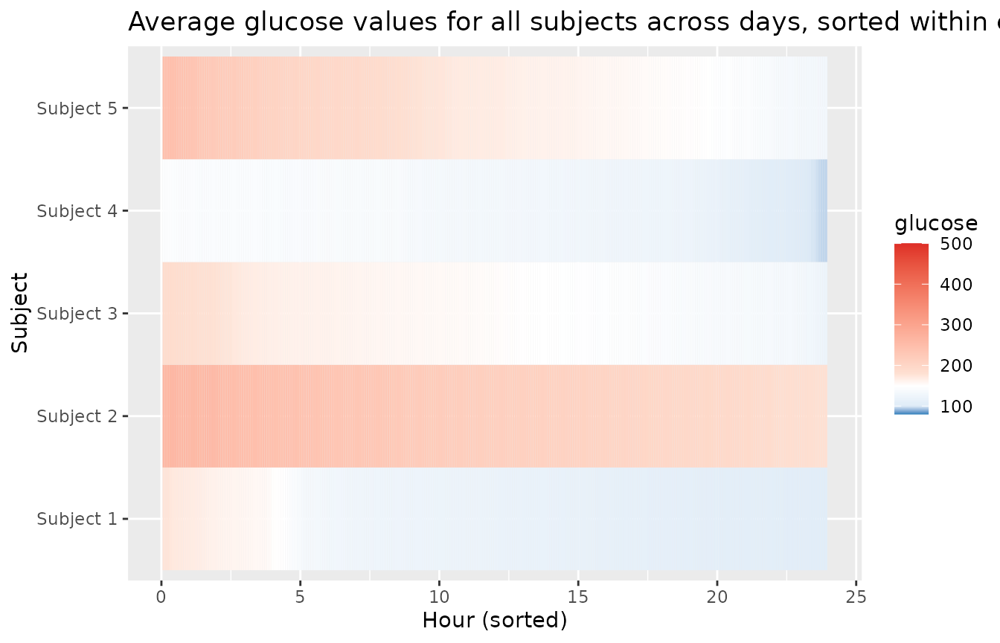

`plot_lasagna_1subject` allows for customization of the more detailed
single subject lasagna plots. There is no datatype parameter for
`plot_lasagna_1subject`, but there are three types of plots available,
accessed with the `lasagnatype` parameter.

``` r

plot_lasagna_1subject(example_data_1_subject, lasagnatype = 'unsorted', tz = 'EST')
```

    ## Warning: Removed 14 rows containing missing values or values outside the scale range
    ## (`geom_tile()`).

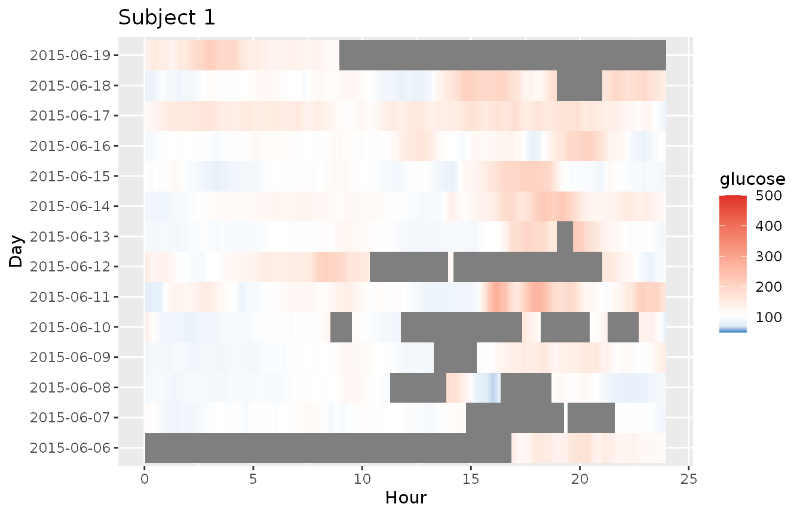

``` r

plot_lasagna_1subject(example_data_1_subject, lasagnatype = 'timesorted', tz = 'EST')
```

    ## Warning: Removed 14 rows containing missing values or values outside the scale range
    ## (`geom_tile()`).

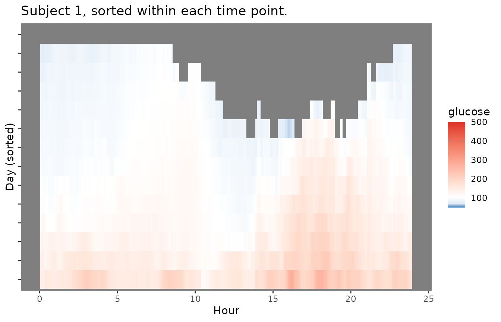

``` r

plot_lasagna_1subject(example_data_1_subject, lasagnatype = 'daysorted', tz = 'EST')
```

    ## Warning: Removed 14 rows containing missing values or values outside the scale range
    ## (`geom_tile()`).

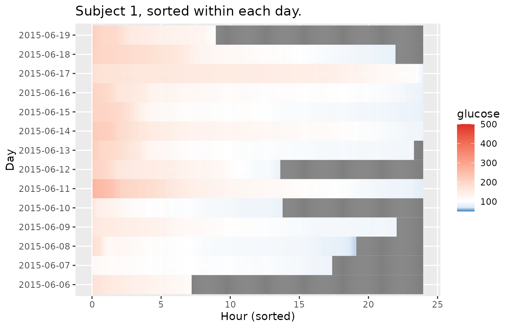

As with the `lasagna_plot` function, changing the LLTR, ULTR, midpoint,
and limits parameters will affect the colorbar.

``` r

plot_lasagna_1subject(example_data_1_subject, lasagnatype = 'daysorted', midpoint = 150, limits = c(80,500), tz = 'EST')
```

    ## Warning: Removed 14 rows containing missing values or values outside the scale range
    ## (`geom_tile()`).

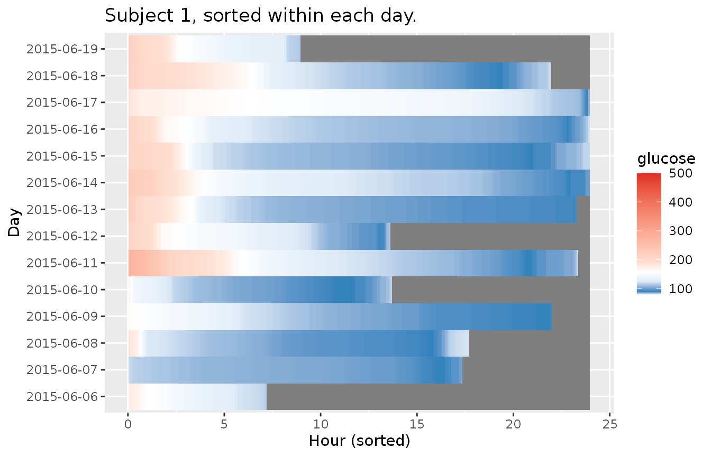
