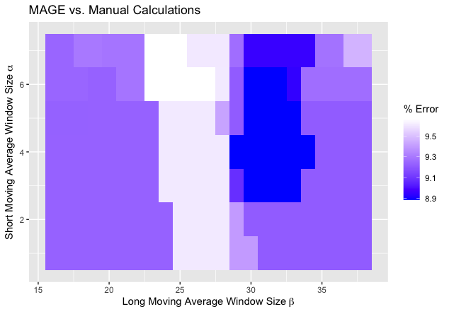
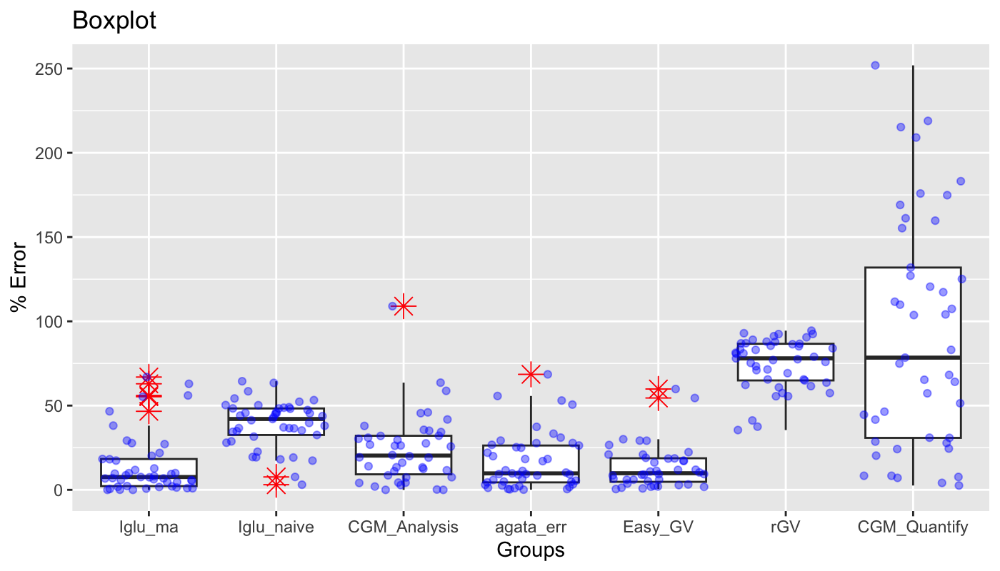
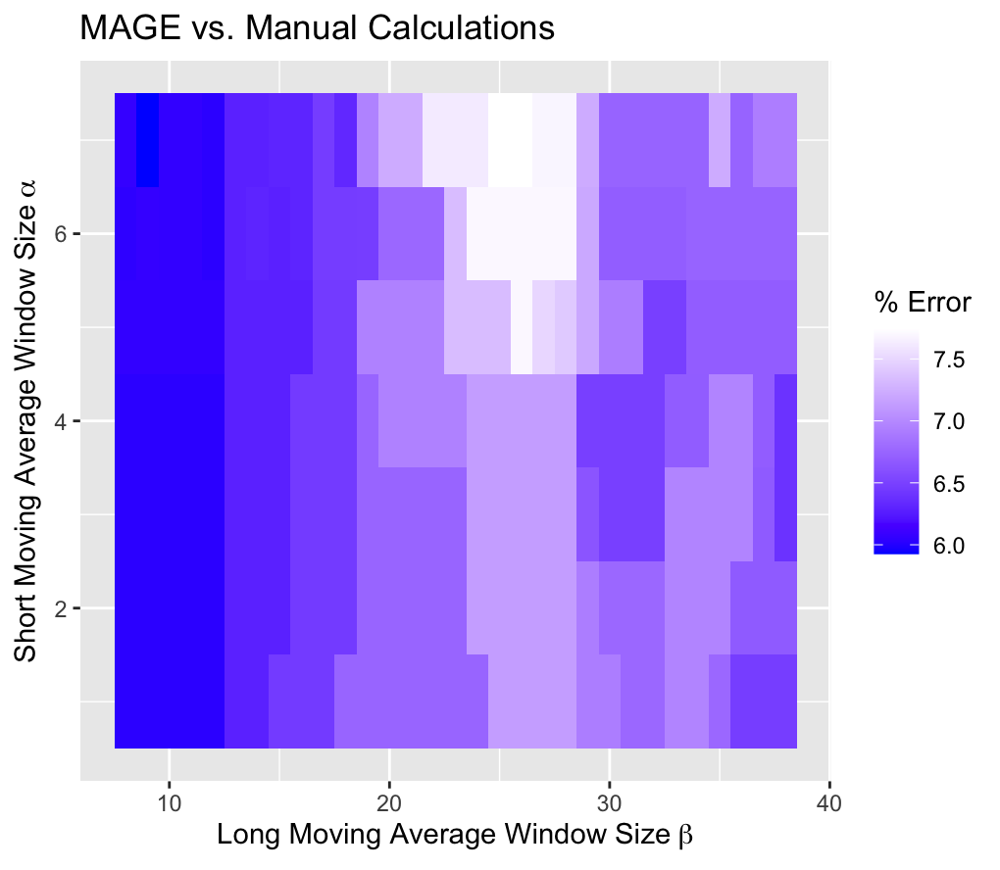
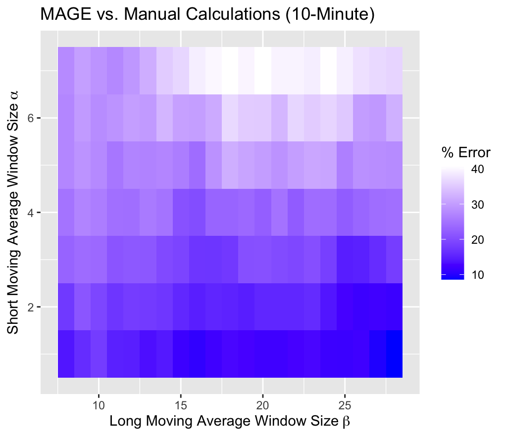
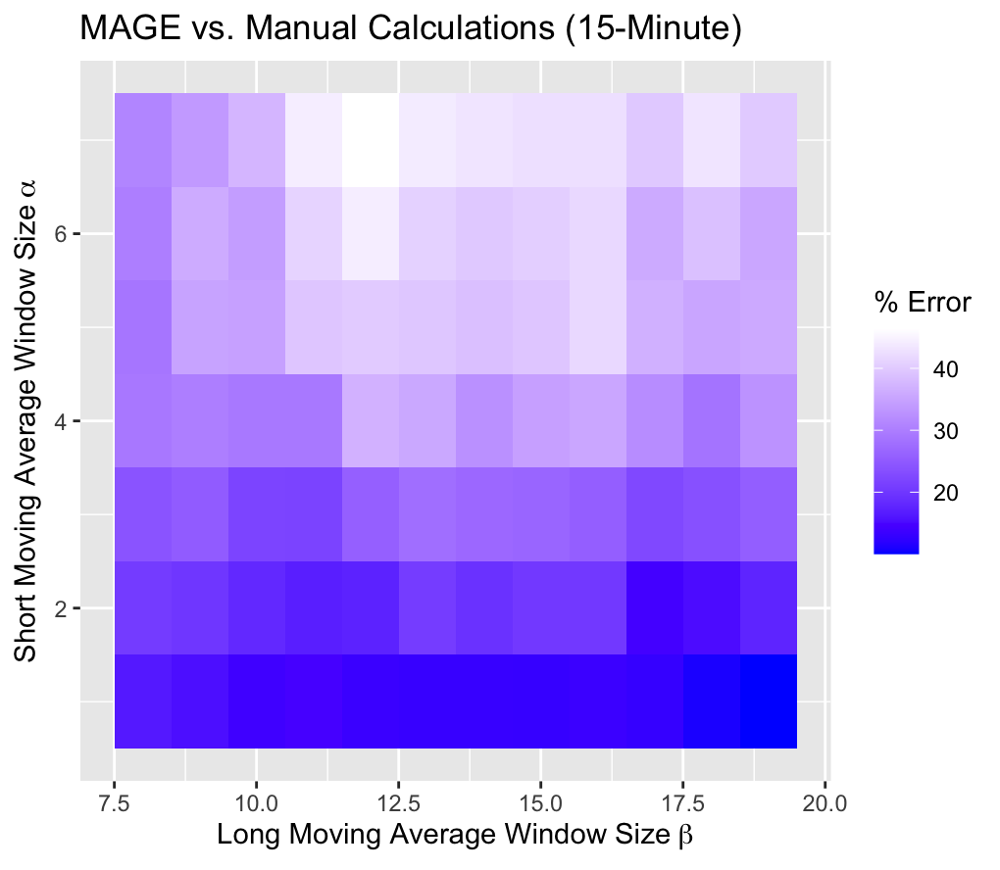
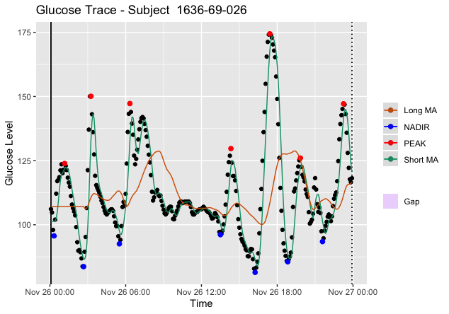
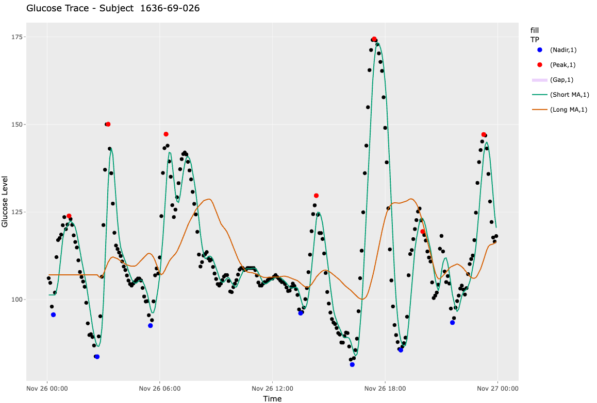

```{r setup, include = FALSE}
knitr::opts_chunk$set(
  collapse = TRUE,
  comment = "#>"
)
library(iglu)
```

Mean Amplitude of Glycemic Excursions (MAGE) is a glucose variability
metric that can be applied to CGM data. From iglu version 3 onward, the
package includes two algorithms for MAGE calculation: (i) version = 'ma'
uses short and long moving averages to computationally emulate the
original definition, (ii) version = 'naive' is a naive approximation
**solely included** for backwards compatibility with earlier versions of
iglu. The moving average algorithm was published in the Journal of
Diabetes Science and Technology: [Open-source Algorithm to Calculate
Mean Amplitude of Glycemic Excursions Using Short and Long Moving
Averages](https://doi.org/10.1177/19322968211061165), and the code to
reproduce all tests can be found at the accompanying repository:
[Nathaniel-Fernandes/mage_algorithm_data](https://github.com/Nathaniel-Fernandes/mage_algorithm_data).
Below is a supplementary vignette describing the algorithm in more
detail, our design choices, and the methods we used to test it. Some
example code to get started using MAGE in iglu is included in the
[*Implementation*](#example_code) section.

# Abstract

**Background**: Glucose variability is increasingly regarded as a risk
factor for diabetes-related complications. The mean amplitude of
glycemic excursions (MAGE) is a common measure of glucose variability.
While its original definition requires manual calculations, there exist
several software programs for automated calculations which have shown
varying degrees of agreement. The objective of this study was to develop
an automated algorithm for MAGE that would achieve high accuracy against
the reference standard of manual calculations and benchmark it against
existing alternatives.

**Methods**: Manual calculations of MAGE were performed on 45 publicly
available CGM profiles from a diverse set of patients (i.e., Type 1
diabetes, Type 2 diabetes, and those without diabetes) following the
definition described in Service et al. [3]. An automated algorithm for
MAGE calculation was developed to identify peaks and nadirs of glycemic
excursions based on the crosses of a short and long moving average of
the glucose profile, and implemented in version 3+ of R package iglu.
The accuracy of the algorithm was evaluated relative to manual
calculations using a five-fold cross-validation and compared to other
publicly available MAGE calculators, as listed in Table 2.

**Results**: The newly developed algorithm had the median error of 1.4%
relative to manual calculations (iglu v4.1.1+). The median errors of the
six other approaches including cgmanalysis, cgmquantify, EasyGV, rGV,
AGATA, and the naive algorithm in the earlier versions of iglu were
20.3%, 78.4%, 11.3%, X%, X%, and 42.0%, respectively.

**Conclusions**: The newly developed algorithm eliminates the need for
tedious manual MAGE calculations and approximates the manual derivation
better than existing approaches.

# Introduction

Glucose variability is increasingly regarded as a risk factor for
diabetes-related complications beyond HbA1c [1, 2]. The mean amplitude
of glycemic excursions (MAGE) is a commonly used measure of glucose
variability. As defined by Service et al. [3], MAGE is the arithmetic
mean of the amplitude (i.e. height) of glucose excursions that are
greater than the standard deviation of the glucose values. MAGE is
calculated manually by visually inspecting the glucose profiles.
However, this manual approach to calculating MAGE is error-prone and
impractical for large data sets of continuous glucose monitors (CGMs).
Thus, an automated algorithm for MAGE calculation that approximates the
manual reference is needed.

Several software programs for automated MAGE calculations have been
developed, and these implementations can be divided into two categories:
those that only return the numeric MAGE values, and those that
additionally provide a visual display of the calculations [4]. Examples
in the first category include the Excel®-based workbook EasyGV [5],
online GlyCulator2 [6], R package cgmanalysis [7], early versions of R
package iglu [8], and Python package cgmquantify [9]. Because these
software programs do not output a visual display of the performed
calculations, the user has no means to inspect the calculations and
confirm accuracy. Examples in the second category include programs
developed by Fritzsche [10] and Baghurst [11]. However, we found the
software developed by Fritzsche are not compatible with newer operating
systems (e.g., Windows 10) to allow importing of CGM data. According to
documentation for cgmanalysis [7] and cgmquantify [9], these packages
provide free implementations of Baghurst's algorithm, albeit they may
not fully reflect the original implementation.

The comparison of GlyCulator, EasyGV, Fritzsche, and Baghurst algorithms
demonstrates varying degrees of agreement across MAGE algorithms [12].
While the aforementioned algorithms were compared to each other, they
were not compared with the manual reference standard.

Thus, the objective of current study is to establish an approach of
calculating MAGE that is user-friendly and approximates well the results
obtained manually. Therefore, these goals are defined as follows.

1.  To computationally emulate the manual method in Service et al. [3]
    with high accuracy based on the automated detection of peaks and
    nadirs tailored specifically towards CGM data

2.  To provide a freely-available implementation with a visual display

To evaluate accuracy, the newly developed algorithm was compared with
the manual derivations along with the other computational approaches.

# Methods

*CGM Data and Manual MAGE Calculation*

Publicly-available CGM data were obtained from [13], from which 45 CGM
traces were selected to represent a diverse set of patients (Type 1
diabetes, Type 2 diabetes, and those without diabetes), see Table 1.
Each CGM trace corresponds to one day of measurements (24 h), where a
day is defined from midnight to midnight as it is customary to calculate
MAGE daily. Manual MAGE calculations were performed on each of the 45
CGM traces following the original description of MAGE calculations by
Service et al. [3] by two of the authors, who were unaware of the
outcome of the proposed algorithm's outputs.

+-------------+-------------+-------------+-------------+-------------+
| Dataset     | Diabetes    | Age group   | Subject ID  | Number of   |
|             | Type        |             |             | days used   |
|             |             |             |             | (CGM        |
|             |             |             |             | traces)     |
+:===========:+:===========:+:===========:+:===========:+:===========:+
| [Hall et    | None        | Adults (\>  | 1636-69-001 | 5           |
| al.         |             | 18)         |             |             |
| (2018)](h   |             |             |             |             |
| ttps://doi. |             |             |             |             |
| org/10.1371 |             |             |             |             |
| /journal.pb |             |             |             |             |
| io.2005143) |             |             |             |             |
+-------------+-------------+-------------+-------------+-------------+
|             |             |             | 1636-69-026 | 6           |
+-------------+-------------+-------------+-------------+-------------+
| [Tsalikian  | Type 1      | Children    | 2           | 1           |
| et al.      |             | (10 - 18)   |             |             |
| (2005)](    |             |             |             |             |
| https://doi |             |             |             |             |
| .org/10.101 |             |             |             |             |
| 6/j.jpeds.2 |             |             |             |             |
| 005.04.065) |             |             |             |             |
+-------------+-------------+-------------+-------------+-------------+
|             |             |             | 7           | 2           |
+-------------+-------------+-------------+-------------+-------------+
|             |             |             | 8           | 1           |
+-------------+-------------+-------------+-------------+-------------+
|             |             |             | 11          | 2           |
+-------------+-------------+-------------+-------------+-------------+
|             |             |             | 15          | 1           |
+-------------+-------------+-------------+-------------+-------------+
|             |             |             | 43          | 1           |
+-------------+-------------+-------------+-------------+-------------+
|             |             |             | 44          | 1           |
+-------------+-------------+-------------+-------------+-------------+
| [Dubosson   | Type 1      | Adults (\>  | 1           | 5           |
| et al.      |             | 18)         |             |             |
| (2005)      |             |             |             |             |
| ](https://d |             |             |             |             |
| oi.org/10.1 |             |             |             |             |
| 016/j.imu.2 |             |             |             |             |
| 018.09.003) |             |             |             |             |
+-------------+-------------+-------------+-------------+-------------+
|             |             |             | 2           | 2           |
+-------------+-------------+-------------+-------------+-------------+
| [Broll et   | Type 2      | Adults (\>  | Subject 1   | 1           |
| al.         |             | 18)         |             |             |
| (2021)](h   |             |             |             |             |
| ttps://doi. |             |             |             |             |
| org/10.1371 |             |             |             |             |
| /journal.po |             |             |             |             |
| ne.0248560) |             |             |             |             |
+-------------+-------------+-------------+-------------+-------------+
|             |             |             | Subject 2   | 5           |
+-------------+-------------+-------------+-------------+-------------+
|             |             |             | Subject 3   | 1           |
+-------------+-------------+-------------+-------------+-------------+
|             |             |             | Subject 4   | 5           |
+-------------+-------------+-------------+-------------+-------------+
|             |             |             | Subject 5   | 6           |
+-------------+-------------+-------------+-------------+-------------+

**Table 1:** Summary of the 45 CGM traces used for manual calculations.
The first three datasets have been obtained as described in [13]. The
last dataset is available within R package iglu [8].

*Existing MAGE Calculators*

We benchmarked the proposed algorithm against a variety of open and
closed-source tools. We looked into the packages below. To the best of
our knowledge, this comprises a relatively exhaustive list of existing
packages to compute metrics on CGM data as of May 15, 2024.

+-----------------+------------+------------+------------+------------+
| Tool or         | **         | B          | **Version  | Release /  |
| Algorithm Name  | Implements | enchmarked | Used**     | Update     |
|                 | MAGE**     | Against?   |            | Date       |
+:===============:+:==========:+:==========:+:==========:+:==========:+
| iglu::mage_ma   | Yes        | Yes        | iglu v4.1  | Present    |
| (Proposed)      |            |            |            |            |
+-----------------+------------+------------+------------+------------+
| i               | Yes        | Yes        | iglu v2.0  | Feb 27,    |
| glu::mage_naive |            |            |            | 2020       |
| (Deprecated)    |            |            |            |            |
+-----------------+------------+------------+------------+------------+
| [Ea             | Yes        | Yes        | EasyGV     | Oct 6,     |
| syGV](https://w |            |            | v9.0       | 2020       |
| ww.ncbi.nlm.nih |            |            |            |            |
| .gov/pmc/articl |            |            | (The       |            |
| es/PMC7591379/) |            |            | [download  |            |
|                 |            |            | link](h    |            |
|                 |            |            | ttps://www |            |
|                 |            |            | .phc.ox.ac |            |
|                 |            |            | .uk/resear |            |
|                 |            |            | ch/resourc |            |
|                 |            |            | es/easygv) |            |
|                 |            |            | for        |            |
|                 |            |            | Version 10 |            |
|                 |            |            | is broken  |            |
|                 |            |            | & only     |            |
|                 |            |            | downloads  |            |
|                 |            |            | Version    |            |
|                 |            |            | 9.0)       |            |
+-----------------+------------+------------+------------+------------+
| [cgmanal        | Yes        | Yes        | c          | Nov 20,    |
| ysis](https://w |            |            | gmanalysis | 2023       |
| ww.ncbi.nlm.nih |            |            | v2.7.7     |            |
| .gov/pmc/articl |            |            |            |            |
| es/PMC6788735/) |            |            |            |            |
+-----------------+------------+------------+------------+------------+
| [               | Yes        | Yes        | rGV v0.0.4 | Jan 17,    |
| rGV](https://cr |            |            |            | 2023       |
| an.r-project.or |            |            |            |            |
| g/web/packages/ |            |            |            |            |
| rGV/index.html) |            |            |            |            |
+-----------------+------------+------------+------------+------------+
| [cgmquantify    | Yes        | Yes        | Commit:    | Feb 8,     |
| ](https://githu |            |            | [          | 2021       |
| b.com/brinnaebe |            |            | d4a788c](h |            |
| nt/cgmquantify) |            |            | ttps://git |            |
|                 |            |            | hub.com/br |            |
|                 |            |            | innaebent/ |            |
|                 |            |            | cgmquantif |            |
|                 |            |            | y/commit/d |            |
|                 |            |            | 4a788cd334 |            |
|                 |            |            | ceeceb348d |            |
|                 |            |            | ec8e4afd3a |            |
|                 |            |            | 745fdab4f) |            |
+-----------------+------------+------------+------------+------------+
| [AGATA](ht      | Yes        | Yes        | agata      | Jan 27,    |
| tps://gcappon.g |            |            | -2.1.1.zip | 2023       |
| ithub.io/agata) |            |            |            |            |
+-----------------+------------+------------+------------+------------+
| [CGDA](http     | Yes        | In         | N/A        | N/A        |
| s://github.com/ |            | Progress:  |            |            |
| EvdVossen/CGDA) |            | Randomly   |            |            |
|                 |            | skips      |            |            |
|                 |            | computing  |            |            |
|                 |            | metrics    |            |            |
|                 |            | for        |            |            |
|                 |            | certain    |            |            |
|                 |            | CGM traces |            |            |
|                 |            | without    |            |            |
|                 |            | fl         |            |            |
|                 |            | ag/warning |            |            |
+-----------------+------------+------------+------------+------------+
| [CGM            | Yes        | In         | N/A        | N/A        |
| Shi             |            | Progress:  |            |            |
| ny](https://git |            | Unable to  |            |            |
| hub.com/rolandh |            | load CSV   |            |            |
| angelbroek/cgms |            | files with |            |            |
| hiny/tree/main) |            | sensor     |            |            |
|                 |            | data       |            |            |
+-----------------+------------+------------+------------+------------+
| ["Group of      | Yes        | No: no     | N/A        | N/A        |
| Signs"          |            | o          |            |            |
| Method](http    |            | pen-source |            |            |
| s://journals.sa |            | impl       |            |            |
| gepub.com/doi/a |            | ementation |            |            |
| bs/10.1177/1932 |            | provided.  |            |            |
| 29680800200614) |            |            |            |            |
+-----------------+------------+------------+------------+------------+
| ["Spline        | Yes        | No: no     | N/A        | N/A        |
| Interpolation"  |            | o          |            |            |
| Met             |            | pen-source |            |            |
| hod](https://ww |            | impl       |            |            |
| w.ijeei.org/doc |            | ementation |            |            |
| s-11671079585b6 |            | provided.  |            |            |
| 939d30eb25.pdf) |            | Coding     |            |            |
|                 |            | from       |            |            |
|                 |            | scratch as |            |            |
|                 |            | per paper  |            |            |
|                 |            | speci      |            |            |
|                 |            | fications. |            |            |
+-----------------+------------+------------+------------+------------+
| ["Linear        | Yes        | No: no     | N/A        | N/A        |
| Interpolation"  |            | o          |            |            |
| Method](https:  |            | pen-source |            |            |
| //d1wqtxts1xzle |            | impl       |            |            |
| 7.cloudfront.ne |            | ementation |            |            |
| t/97165680/1111 |            | provided.  |            |            |
| -libre.pdf?1673 |            | Coding     |            |            |
| 493701=&respons |            | from       |            |            |
| e-content-dispo |            | scratch as |            |            |
| sition=inline%3 |            | per paper  |            |            |
| B+filename%3DMe |            | speci      |            |            |
| asurement_of_MA |            | fications. |            |            |
| GE_Mean_Amplitu |            |            |            |            |
| de_of_Gl.pdf&Ex |            |            |            |            |
| pires=171569478 |            |            |            |            |
| 4&Signature=L83 |            |            |            |            |
| vsE7uLy9wiVjqnn |            |            |            |            |
| LfLCFQuisXMxX-s |            |            |            |            |
| Dtuc~b-8yIV0Bsf |            |            |            |            |
| xSI7S1NTvytr-00 |            |            |            |            |
| bLPvPx7yy9PZwK3 |            |            |            |            |
| B9o2L6IVKS723kk |            |            |            |            |
| jT2vVDPo7lQFB96 |            |            |            |            |
| z4y30iclITG9rT- |            |            |            |            |
| NZROEumDffb9hb~ |            |            |            |            |
| 0tPov6GEQJUfRvE |            |            |            |            |
| bnN0htcXM1832E9 |            |            |            |            |
| n0GhM7LrsYq1~si |            |            |            |            |
| MmfSpKfkj8fdSUV |            |            |            |            |
| FjQ2H8U-e-x0Twm |            |            |            |            |
| UmerEwtbmVhsjmq |            |            |            |            |
| SGCQ21slLhZdp18 |            |            |            |            |
| bK0XokncafAP5sJ |            |            |            |            |
| AiRpuwcz63ssaNf |            |            |            |            |
| bk4GcUh0AJC7SXC |            |            |            |            |
| wz6Y2kN5TSGjbaL |            |            |            |            |
| Mz5pUcafM7vRqA- |            |            |            |            |
| GaEc3Rcl0DrI8l4 |            |            |            |            |
| u6X3Zdzbw__&Key |            |            |            |            |
| -Pair-Id=APKAJL |            |            |            |            |
| OHF5GGSLRBV4ZA) |            |            |            |            |
+-----------------+------------+------------+------------+------------+
| [GVAP           | Yes        | No:        | N/A        | N/A        |
| Tool](          |            | Requires   |            |            |
| https://link.sp |            | CGM traces |            |            |
| ringer.com/arti |            | to have    |            |            |
| cle/10.1186/s12 |            | \>100      |            |            |
| 938-015-0035-3) |            | points,    |            |            |
|                 |            | which      |            |            |
|                 |            | fails to   |            |            |
|                 |            | work with  |            |            |
|                 |            | some       |            |            |
|                 |            | manual     |            |            |
|                 |            | traces     |            |            |
|                 |            | with large |            |            |
|                 |            | gaps       |            |            |
+-----------------+------------+------------+------------+------------+
| [               | Yes        | No: Cannot | N/A        | N/A        |
| CGMTSA](https:/ |            | process    |            |            |
| /github.com/Rya |            | some CGM   |            |            |
| nJ-Shao/CGMTSA) |            | traces     |            |            |
|                 |            | when less  |            |            |
|                 |            | than 24    |            |            |
|                 |            | hours      |            |            |
|                 |            | worth of   |            |            |
|                 |            | data       |            |            |
+-----------------+------------+------------+------------+------------+
| [CGMStatsAnal   | Yes        | No: Unable | N/A        | N/A        |
| yser](https://b |            | to load    |            |            |
| aker-biostats.s |            | CSV files  |            |            |
| hinyapps.io/CGM |            | with       |            |            |
| StatsAnalyser/) |            | sensor     |            |            |
|                 |            | data       |            |            |
+-----------------+------------+------------+------------+------------+
| [Fritzch        | Yes        | No:        | N/A        | N/A        |
| e](https://pubm |            | Software   |            |            |
| ed.ncbi.nlm.nih |            | in         |            |            |
| .gov/21291337/) |            | compatible |            |            |
|                 |            | with       |            |            |
|                 |            | modern     |            |            |
|                 |            | operating  |            |            |
|                 |            | systems    |            |            |
|                 |            | (Windows   |            |            |
|                 |            | 10 /       |            |            |
|                 |            | MacOS)     |            |            |
+-----------------+------------+------------+------------+------------+
| [Gly            | Yes        | No:        | N/A        | N/A        |
| Culator2](https |            | program    |            |            |
| ://docs.google. |            | requires   |            |            |
| com/spreadsheet |            | spe        |            |            |
| s/d/11FA_kZiYe1 |            | cification |            |            |
| CGuzI7J7daHi289 |            | of exact   |            |            |
| qyEAAtMZ-ylcwg4 |            | \# of      |            |            |
| CYM/edit#gid=0) |            | glucose    |            |            |
| &               |            | values     |            |            |
| [Gl             |            | which      |            |            |
| yCulator3](http |            | fails to   |            |            |
| s://doi.org/10. |            | work with  |            |            |
| 2337/dc22-0534) |            | varia      |            |            |
|                 |            | ble-length |            |            |
|                 |            | MAGE       |            |            |
|                 |            | c          |            |            |
|                 |            | omputation |            |            |
|                 |            | or CGM     |            |            |
|                 |            | traces     |            |            |
|                 |            | with gaps  |            |            |
+-----------------+------------+------------+------------+------------+
| [MAGECAA        | Yes        | No:        | N/A        | N/A        |
| v1.0](ht        |            | Close      |            |            |
| tps://www.ncbi. |            | d-source - |            |            |
| nlm.nih.gov/pmc |            | copy       |            |            |
| /articles/PMC5) |            | requested  |            |            |
|                 |            | from the   |            |            |
|                 |            | author     |            |            |
+-----------------+------------+------------+------------+------------+
| [Baghurs        | Yes        | No:        | N/A        | N/A        |
| t](https://pubm |            | Close      |            |            |
| ed.ncbi.nlm.nih |            | d-source - |            |            |
| .gov/21291334/) |            | un         |            |            |
|                 |            | successful |            |            |
|                 |            | attempt to |            |            |
|                 |            | contact    |            |            |
|                 |            | author.    |            |            |
+-----------------+------------+------------+------------+------------+
| CGM-Guide       | Yes        | No:        | N/A        | N/A        |
|                 |            | clos       |            |            |
|                 |            | ed-source. |            |            |
|                 |            | Unable to  |            |            |
|                 |            | acquire a  |            |            |
|                 |            | copy.      |            |            |
+-----------------+------------+------------+------------+------------+
| KAMOGAWA        | Yes        | No:        | N/A        | N/A        |
|                 |            | clos       |            |            |
|                 |            | ed-source. |            |            |
|                 |            | Unable to  |            |            |
|                 |            | acquire a  |            |            |
|                 |            | copy.      |            |            |
+-----------------+------------+------------+------------+------------+
| Tidepool        | No         | N/A        | N/A        | N/A        |
+-----------------+------------+------------+------------+------------+
| [CGM            | No         | N/A        | N/A        | N/A        |
| Viewer](h       |            |            |            |            |
| ttps://adaychen |            |            |            |            |
| .shinyapps.io/s |            |            |            |            |
| hinyspecclust/) |            |            |            |            |
+-----------------+------------+------------+------------+------------+
| [GLU](          | No         | N/A        | N/A        | N/A        |
| https://github. |            |            |            |            |
| com/MRCIEU/GLU) |            |            |            |            |
+-----------------+------------+------------+------------+------------+
| [C              | No         | N/A        | N/A        | N/A        |
| GMAnalyzer](htt |            |            |            |            |
| ps://cran.r-pro |            |            |            |            |
| ject.org/web/pa |            |            |            |            |
| ckages/CGManaly |            |            |            |            |
| zer/index.html) |            |            |            |            |
+-----------------+------------+------------+------------+------------+

*The Algorithm*

The original MAGE description in Service et al. [3] requires (i)
identification of turning points (e.g., peaks and nadirs) for
calculation of glucose excursions; (ii) filtering those turning points
to only keep relevant glucose excursions and calculating the mean of
those excursion amplitudes (i.e., heights).

To the best of our knowledge, our implementations for both parts (i) and
(ii) are unique.

(i) **Identification of peaks and nadirs.** The proposed algorithm uses
    the crosses of a short and long moving average to identify time
    intervals where a peak or nadir may exist. Let $\alpha$ be the
    window size for the short moving average and 𝛽 be the window size
    for the long moving average, such that $\alpha < \beta$. Since the
    shorter moving average is more affected by local variation in the
    glucose values than the longer moving average, a peak or nadir
    (i.e., a turning point, ${tp}_i$) must exist on the intervals that
    are bounded by the crosses of the two moving averages $cp_i$ and
    $cp_{i+1}$ as demonstrated in Figure 1, with the exception of
    "whiplash". (Note: the first and last glucose values are always
    treated as crossing points [Appendix: [Why are the first and last
    data points always treated as crossing points?]].) To solve the
    issue of "whiplash", where the true peak/nadir falls outside the
    interval bounded by $cp_i$ and $cp_{i+1}$ for back-to-back
    sinusoidal excursions [Appendix: [What is whiplash?]], we make the
    assumption that peaks and nadirs alternate (peak, nadir, peak,
    nadir, etc.) or vice versa and calculate subsequent peaks or nadirs
    sequentially as the maximum or minimum glucose value, respectively,
    between the index of $tp_{i-1}$ (left boundary, exclusive) and
    $cp_{i+1}$ (right boundary, inclusive) for $i=2$. The left boundary
    is $cp_{i}$ for the base case of $i=1$.

    A distinct advantage of using moving averages to identify the
    turning points is that they inherently smooth out local fluctuations
    and noise within larger trends in a glucose profile. The amount of
    smoothing can be tuned by varying window size parameters $\alpha$
    and $\beta$. By default, the algorithm uses $\alpha = 5$ and
    $\beta = 32$ as these values maximized the algorithm's accuracy on
    the manual MAGE calculations, where $\alpha \in [1, 7]$ and
    $\beta \in [16, 38]$.

(ii) **Eliminating Excursions and Calculation of Mean Amplitudes.** An
     excursion is defined by three turning points
     $E_{i,j,k}=(tp_i, tp_j, tp_k) \text{ s.t. } i < j < k$ , where the
     amplitude of the excursion is calculated as follows:
     $a(j, i) = |tp_j - tp_i|$ and
     $|E_{i,j,k}| = (|E_{left}|,|E_{right}|)=(a(j, i), a(k, j))$. An
     "acceptable" excursion, as defined by Service et al. [3], requires
     the amplitudes of both the left-side and right-side half-excursions
     to exceed the standard deviation of the entire CGM trace.
     Computationally, we devised the procedure below to calculate
     acceptable excursions, given a set of alternating turning points.
     To prevent double counting excursions, only ascending (MAGE+) or
     descending (MAGE--) half-excursion amplitudes are averaged (i.e.,
     $|E_{left}|$ or $|E_{right}|$, respectively), where ascending means
     $tp_j$ is a peak and vice versa. When excursions are symmetric,
     MAGE+ = MAGE--, however in general they may disagree [11]. By
     default, our implementation follows the description in Service et
     al. [3], and returns MAGE+ or MAGE-- depending on which type of
     excursion first crosses the one SD threshold; however, the user can
     specify either if desired.

     *Procedure:* Starting from $i=1, j=2$ (note: R is 1-based), check
     whether the amplitude exceeds the one standard deviation threshold,
     $a(j, i) = a(2, 1) > sd$. If false, the algorithm will calculate
     $\max\; \{a(3,1), \; a(3,2)\} > sd$ and so on until a large enough
     amplitude is found or the CGM trace ends. Note: we use the maximum
     to enable "accumulation", an optimization that allows an earlier
     larger half-excursion to absorb a later smaller half-excursion.
     Once an acceptable left-side half-excursion is found, the
     boundaries $i$ and $j$ are recorded and the same procedure is used
     to find an acceptable right-side excursion, where $j$ is updated if
     $a(k, i) >= a(j, i)$. We record $E_{left}$ once $E_{right} > sd$ or
     the CGM trace ends.

*Handling Gaps*

The algorithm outlined above assumes that the input CGM trace should be
treated contiguously, with MAGE calculated over the entire trace and
turning points alternate (peak, nadir, peak, nadir, etc.) or vice versa.
However, this can lead to suboptimal results if large gaps are present
in the trace. While small gaps can be interpolated before MAGE
calculation (starting in iglu v3.3.0), CGM values separated by large
gaps should be treated as separate segments, with MAGE calculated on
each segment independently. By default, MAGE released in iglu v3.5.1+
segments the CGM trace by gaps larger than
$max\_gap=180 \text{ minutes}$ and calculates MAGE via the above
algorithm on each segment [Appendix: [Why set a default of 180 minutes
for max_gap?]]. The user can then return the MAGE values for each
segment ($MAGE_i$) or a one-number summary for the variability of the
entire CGM trace ($MAGE_{overall}$). MAGE for the entire trace is
reported as an average of the segment MAGE values, weighted by segment
length ($MAGE_{overall} = \Sigma \frac{n_i}{N}MAGE_i$, where $n_i$ is
the length of segment $i$ and $N = \Sigma n_i$). The plot displays
segments with a solid, black vertical line for the left-boundary and a
dashed, black vertical line for the right boundary.

<a name="example_code"></a>\
*Implementation*\
The newly developed algorithm for MAGE calculation can be found from
version 3 onward in R package iglu [17] as well as the accompanying GUI
via Shiny App [8] - both are free and open-source. Implementation in a
script-based programming language like R allows the creation of
reproducible scripts for all data processing and MAGE calculation steps,
and the availability of a point-and-click GUI meets the needs of
researchers with limited programming experience. By default, the
algorithm uses $\alpha = 5$ and $\beta = 32$, however these choices can
be adjusted by the user.

```{r mage example, message = FALSE, warning=FALSE}
# load package and example data
library(iglu)

# mage calculation using default parameters
mage(example_data_5_subject)

# Adjust default window sizes in mage calculation
mage(example_data_5_subject, short_ma = 3, long_ma = 30)
```

In addition to providing a numerical MAGE value, the software allows the
creation of glucose trace plots that highlight the selected peaks and
nadirs used for MAGE calculation.

```{r figure 1, fig.height=5, fig.width=7}
# subset data to better see identified peaks and nadirs
fig1data <- example_data_1_subject[1:200, ]
# plot using mage function with plot = TRUE and show_ma = TRUE 
mage(fig1data, plot = TRUE, show_ma = TRUE, title = "Glucose Trace - Subject 1")
```

**Figure 1:** Glucose trace of Subject 2 with Type 2 diabetes from Broll
et al. [8], the solid green line is a short MA with $\alpha$ = 5 and the
solid orange line is a long MA with $\beta$ = 32. The peaks and nadirs
occur between the crosses of short and long moving averages. By default,
the algorithm calculates MAGE+ as in this profile the first segment to
exceed one SD threshold is ascending. The provided graphical display in
iglu software [17] automatically highlights only those peaks (red) and
nadirs (blue) that are used for final calculation.

   

Additionally, the plot will highlight any gaps in the data due to
missing readings. If these gaps are shorter than $max\_gap = 180$, they
will be part of the same segment.

```{r figure 2, fig.width=7, fig.height=5}

# subset data to better show gaps
fig2data <- example_data_1_subject[200:400, ]
# plot using mage function with plot = TRUE
mage(fig2data, plot = TRUE, title = "Glucose Trace with Gaps - Subject 1")
```

**Figure 2**. Glucose trace of Subject 5 with Type 2 diabetes from Broll
et al. [8] with regions of missing glucose readings automatically
highlighted using iglu software [17].

   

*Assessment of Accuracy*\
The accuracy of the proposed algorithm was evaluated against 45 manual
calculations. For each CGM trace, the accuracy was measured as the
relative percent difference in the automatically calculated MAGE value
and the manual MAGE value, that is:
$\frac{|MAGE_{algorithm} - MAGE_{manual}|}{MAGE_{manual}}\cdot 100\%$ .

To find optimal combination of window sizes, we considered
$\alpha \in [1, 7]$ and $\beta \in [16, 38]$, and recorded the mean
errors across 45 CGM traces for each pair of ($\alpha, \beta$) values.
The optimal ($\alpha, \beta$) pair was determined as the one that leads
to the minimal in-sample error. Since the obtained minimal error is a
biased assessment of accuracy as the optimal ($\alpha, \beta$) were
selected based on the same 45 traces, five-fold cross-validation was
also performed to gain an unbiased assessment of accuracy. The 45 CGM
traces were randomly split into five groups of nine samples each. The
best ($\alpha, \beta$) combination was then chosen using four out of the
five groups, and used to evaluate the accuracy on the remaining group.
The best combination was defined as the one that gave the lowest percent
error compared to manual calculations. This out-of-sample evaluation was
performed on all five groups.

The accuracy of EasyGV [5], cgmanalysis [7], cgmquantify [9], rGV,
AGATA, and the MAGE algorithm implemented in the earlier version of iglu
[8] was also determined against the manual reference derivation. The
latter is a naive simplification of original MAGE definition, as it
calculates MAGE as the mean of absolute differences between glucose
values and the glucose mean that are larger than one standard deviations
(and thus does not attempt to explicitly identify peaks and nadirs). We
use iglu_ma to denote the proposed algorithm based on moving averages,
and iglu_naive to denote the naive algorithm used in earlier versions of
the software. We were unable to evaluate GlyCulator2 [6] because the
software requires CGM trace to have at least 576 time points, and thus
returns NA when applied to 24-hour CGM data. We were also unable to
evaluate Fritzsche [10] as importing the CGM data into the provided user
interface on Windows 10 lead to errors.

*Assessment of Parameter Frequency Invariance*

We also test if the optimal long and short window parameters  - i.e.,
($\alpha_{best}, \beta_{best}$) - are invariant to the frequency of the
meter / CGM data (e.g., 1-, 5-, 10-, and 15-minute). To do this, we use
the `iglu::CGMS2DayByDay` function to change the frequency to 1-, 10-,
and 15-minute intervals, and automatically imputes glucose values for
gaps less than 45 minutes. We then rerun the hyperparameter tuning code
to discover the best ($\alpha, \beta$) selected on the new data and
report the mean, median, and IQR of errors. Note that this is not a
perfect comparison: information is lost when downsampling the 5-minute
CGM trace to 10- and 15-minutes but the manual calculations compared
against are performed on 5-minute data. Thus, we expect to see degraded
performance on the 10- and 15-minute data simply due to this design
limitation and not necessarily an algorithm limitation.

# Results

The optimal choice of window sizes ($\alpha, \beta$) for the proposed
algorithm on the 5-minute CGM data was determined to be (5, 32) as this
combination minimized the average error relative to 45 manual
calculations. Figure 3 shows a heatmap of the percent average error
(across 45 traces) as a function of $\alpha$ and $\beta$, where the
darkest regions represent the most favorable combinations of $\alpha$
and $\beta$. (Note: while there was a tie, we chose hyperparameters in
the middle of the dark region.) The minimum corresponds to a mean
average error of 8.9% with a much smaller median percent error of 1.4%
and [Q1, Q3] = [0.5%, 7.1%]. As expected, the unbiased out-of-sample
cross-validated errors are slightly larger, but still relatively low:
9.1% mean with the median of 10.0% and inter-quartile range of [9.4%,
11.8%].

```{r, echo=FALSE, fig.width=10, fig.height=7, out.width="700px", out.height ="400px"}

```

**Figure 3.** Heatmap of average errors over 45 CGM traces of
automatically calculated MAGE values via proposed algorithm relative to
manual MAGE values. The short moving average window size
$\alpha \in [1, 7]$ and the long moving average window size
$\beta \in [16, 38]$. The darker regions correspond to smaller errors,
with the minimal error of % achieved at $\alpha = 5$, $\beta = 32$.

   

Compared to the other available automated algorithms, the next best
results were achieved by EasyGV, which had an average error of 23.4%,
the median error of 11.3% and the IQR of [6.0%, 22.3%]. In constrast,
cgmanalysis, iglu_naive, and cgmquantify all had significantly higher
errors, with median errors (and interquartile range) of 20.3% [8.6%,
32.1%], 42.0% [32.6%, 48.3%], and 78.4% [30.8%, 131.9%], respectively.
Figure 4 shows boxplots of relative errors of all algorithms on 45 CGM
traces.

```{r, echo=FALSE, fig.width=10, fig.height=7, out.width="700px", out.height ="400px"}

```

**Figure 4.** Comparison of relative errors of different automatic
algorithms for MAGE calculation relative to manual MAGE values on 45 CGM
traces. The proposed method is implemented as ma (moving average)
algorithm in R package iglu [17]; best corresponds to the errors with
$\alpha = 5$, $\beta = 32$; cv corresponds to the out-of-sample errors
based on 5- fold-cross-validation for $\alpha, \beta$.

   

For the proposed algorithm, both in-sample errors with the best choice
of window sizes ($\alpha, \beta$) and out-of-sample cross-validated
errors are displayed. The corresponding numerical summaries are
summarized in Table 2.

|    Algorithm    | Mean  | Median |       IQR       |
|:---------------:|:-----:|:------:|:---------------:|
| iglu (ma, best) | 8.9%  |  1.4%  |  [0.5%, 7.1%]   |
|  iglu (ma, cv)  | 9.1%  | 10.0%  |  [9.4%, 11.8%]  |
|  iglu (naive)   | 39.0% | 42.0%  | [32.6%, 48.3%]  |
|     EasyGV      | 23.4% | 11.3%  |  [6.0%, 22.3%]  |
|   cgmanalysis   | 23.9% | 20.3%  |  [8.6%, 32.1%]  |
|   cgmquantify   | 91.9% | 78.4%  | [30.8%, 131.9%] |
|       rGV       | 74.7% | 78.1%  | [64.9%, 86.7%]  |
|      AGATA      | 16.7% |  9.8%  |  [4.4%, 26.3%]  |

**Table 3:** Numerical summaries of relative errors of automatic MAGE
calculators on 45 CGM traces compared to manual calculations. The
proposed method is implemented as ma (moving average) algorithm in R
package iglu [17]; best corresponds to the errors with $\alpha$ = 5,
$\beta$ = 32; cv corresponds to the out-of-sample errors based on
5-fold-cross-validation for $\alpha$, $\beta$.

   

```{r, echo=FALSE, fig.width=10, fig.height=7, out.width="700px", out.height ="400px"}

```

```{r, echo=FALSE, fig.width=10, fig.height=7, out.width="700px", out.height ="400px"}

```

```{r, echo=FALSE, fig.width=10, fig.height=7, out.width="700px", out.height ="400px"}

```

# Discussion

There are several software programs for automatic MAGE calculation,
however, they show varying agreement [12]. In the current study, a new
automated algorithm for MAGE was developed based on moving averages
which demonstrated the least amount of error relative to manual
reference when compared to other automated algorithms.

The newly developed algorithm approximated the manual results better
than EasyGV, cgmanalysis, iglu_naive, and cgmquantify. The largest
discrepancy was noted for cgmanalysis and cgmquantify both of which
implemented Baghurst's algorithm [11]. It is unclear whether the
deviation from manual reference is due to the underlying algorithm or
the specific of implementations of the algorithm. The differences in
accuracy among the MAGE algorithms points to the necessity of a visual
display of the underlying calculations with identified peaks and nadirs.
While such visual display is implemented for the proposed MAGE algorithm
in version 3 of R package iglu [17], this functionality is absent from
EasyGV, cgmanalysis, and cgmquantify, making it more difficult for the
user to verify the accuracy.

A major challenge for any automated MAGE algorithm is separation of true
peaks and nadirs in a larger trend from the smaller glucose
fluctuations. A particular advantage of the proposed algorithm is the
use of moving averages which inherently smooth out local fluctuations
within a larger trend. The amount of smoothing can be tuned by varying
the window sizes of the short and long moving averages, and we found
that the algorithm is quite robust to the choice of window sizes, with
high accuracy in a large range (Figure 3). One disadvantage is that the
moving average is a lagging indicator, and thus is undefined in the
beginning of the time period (e.g., a moving average of window size 20
is undefined for the first 19 time points). This could skew the
calculations of MAGE if the first times points contain a lot of
variation in subject's glucose levels. To adjust for this, the algorithm
replaces the undefined moving average values at the first time points
with the first calculated moving average value (e.g., a moving average
of window size 20 will be first calculated at 20th time point, and that
same value will be assigned to the first 19 time point to be later used
in determining the crosses of short and long moving averages). This
adjustment can be seen for the long moving average in Figure 1, where
its value is flat for the first 32 points. Given the high accuracy of
the proposed algorithm compared to manual calculations, this adjustment
is adequate, however it is possible that it may not be adequate for some
CGM profiles. In practice, we recommend to inspect the visual display of
MAGE calculations provided by iglu [17] as in Figures 1 and 2 for
additional accuracy validation. Another challenge for MAGE calculations
is the presence of asymmetric excursions. To prevent double counting,
typically only ascending (MAGE+) or descending (MAGE--) excursion
amplitudes are averaged. When excursions are symmetric, MAGE+ = MAGE--,
and the accuracy is not affected irrespective of the choice of
direction. However, when excursions are asymmetric, the direction
matters as the two disagree. By default, our algorithm follows the
description in Service et al. [3], and calculates MAGE+ or MAGE--
depending on which type of excursion first crosses the one SD threshold.
The same decision is made in [12]. However, Baghurst [11] argues that it
is more appropriate to use
$MAGE_{avg} = \frac{1}{2}(MAGE_{plus}+MAGE_{minus})$. Our implementation
allows the user to change the default settings, and explicitly calculate
MAGE+, MAGE--, MAGEavg, or MAGEmax, which makes our algorithm's
implementation more flexible compared to existing MAGE software.

### Important Notes on Other Packages

1.  We used AGATA's built-in "retimeGlucose(data, timestep)" to make the
    raw glucose data into a homogenous grid of 5-minute intervals. This
    is similar to the iglu::CGMS2DayByDay.
2.  rGV outputs all 20's regardless of the input data - this behavior is
    reproducible even with the example given in the rGV function. This
    is a major bug that requires immediate attention. The authors have
    raised a GitHub issue & emailed the authors.
3.  cgmquantify may have a bug in the mage computation which might
    explain why the errors are comparatively so high
    (<https://github.com/brinnaebent/cgmquantify/issues/10>). This is a
    major bug that requires immediate attention. The author has been
    contacted.

# Conclusion

We pressent a new algorithm for MAGE calculation that significantly
outperforms existing algorithms. The implementation of this algorithm is
free and open-source, it is available in the R package iglu version 3
[17] as well as in the accompanying GUI via Shiny App at
<https://irinagain.shinyapps.io/shiny_iglu/>. Furthermore, the visual
displays of the CGM traces, exact values for manual MAGE and the code to
reproduce all analyses, along with instructions on how to download each
CGM trace, are publicly available at
<https://github.com/Nathaniel-Fernandes/mage_algorithm_data>. The public
nature of CGM traces, manual MAGE values, and the algorithm allow
additional validation of presented results by a community at large.

**Funding Sources**: NSF CAREER Award DMS-2044823 to IG

**Acknowledgements**: The source of subset of the data is the T1D
Exchange, but the analyses, content and conclusions presented herein are
solely the responsibility of the authors and have not been reviewed or
approved by the T1D Exchange.

**Disclosures**: None

# Appendix

#### Why are the first and last data points always treated as crossing points?

If we didn't, we would throw away at the beginning or end of CGM trace
because the MAGE algorithm calculates MAGE between the first and last
crossing point. For example, assume a CGM trace of 100 values with the
first and last crossing point at index 20 and 80, respectively. The
turning points are looked for between index 20 and 80, which throws out
the beginning and end. Thus, we automatically record the first and last
points in the CGM trace as crossing points.

#### What is whiplash?

We coined the term whiplash to describe two back-to-back excursions that
roughly form a sinusoid. These sinusoidal excursions pose a problem for
identifying the true peaks and nadirs defining an excursion since the
moving average is a lagging indicator. In other words, at the end of one
period of a sinusoidal excursion, the long moving average will be
approximately equal to the short moving average (i.e.,
$MA_{long}(\vec x)\approx MA_{short}(\vec x)\approx \bar x$). Since the
moving average is a lagging indicator, by the time a cross between the
short and long moving average occurs, the true peak or nadir indicating
the start of an excursion may have already occurred. Thus, starting in
MAGE iglu v3.5.1, we calculate turning points sequentially between
$tp_{i-1}$ and $cp_{i+1}$ as compared to $cp_i$ and $cp_{i+1}$,
previously. See the difference in the identified $tp_{12}$ in the images
below, the first being MAGE iglu v3.5.1 (whiplash corrected) and the
second MAGE iglu v3.5.0 (whiplash not corrected).

```{r, echo=FALSE, fig.width=10, fig.height=7, out.width="700px", out.height ="400px"}

```

**Figure 5.** Plot of Subject 1636-69-026 via MAGE iglu v3.5.1 with
correction for whiplash. Notice the true peak is properly identified for
$tp_{12}$.

```{r, echo=FALSE, fig.width=10, fig.height=7, out.width="700px", out.height ="400px"}

```

**Figure 6.** Plot of Subject 1636-69-026 via MAGE iglu v3.5.0 without
whiplash corrected for. Notice the true peak is not properly identified
for $tp_{12}$.

#### Why set a default of 180 minutes for `max_gap`?

The purpose of `max_gap` is to split the CGM trace into different
logical segments - i.e., there are so many missing values between
segments 1 and 2 that it makes more sense to treat them as separate than
as one continuous trace. For example, say a patient wears their CGM on
Monday and Wednesday but forgets on Tuesday. There would be a stretch of
24-h of missing data! Thus, it makes more sense to calculate MAGE on
Monday and Wednesday independently, as we cannot extrapolate what
occurred in the time in-between.

While it is fairly obvious in the above example that we should segment
the CGM trace, what about shorter stretches of missing data? Since the
purpose of MAGE is to calculate the mean amplitude of glycemic
*excursions*, the ideal `max_gap` will split the trace when there is a
possibility of missing an excursion. Since post-prandial excursions
typically last a maximum of 180 minutes [citation needed], we chose 180
minutes as an acceptable default threshold. To explain in natural
language: if we have \>180 minutes of missing data, we likely have
missed either an entire excursion or multiple excursions, so we treat
the trace as two distinct segments.

# References

[1] Kovatchev BP. Metrics for glycemic control---from HbA1c to
continuous glucose monitoring. Nature Reviews Endocrinology. 2017
Jul;13(7):425-36.

[2] Service FJ. Glucose variability. Diabetes. 2013 May;62(5):1398-404.

[3] Service FJ, Molnar GD, Rosevear JW, Ackerman E, Gatewood LC, Taylor
WF. Mean amplitude of glycemic excursions, a measure of diabetic
instability. Diabetes. 1970 Sep 1;19(9):644-55.

[4] Yu X, Lin L, Shen J, Chen Z, Jian J, Li B, Xin SX. Calculating the
mean amplitude of glycemic excursions from continuous glucose data using
an open-code programmable algorithm based on the integer nonlinear
method. Computational and mathematical methods in medicine. 2018 Mar
8;2018.

[5] Hill NR, Oliver NS, Choudhary P, Levy JC, Hindmarsh P, Matthews DR.
Normal reference range for mean tissue glucose and glycemic variability
derived from continuous glucose monitoring for subjects without diabetes
in different ethnic groups. Diabetes technology & therapeutics. 2011 Sep
1;13(9):921-8.

[6] Pagacz K, Stawiski K, Szadkowska A, Mlynarski W, Fendler W.
GlyCulator2: an update on a web application for calculation of glycemic
variability indices. Acta diabetologica. 2018 Aug;55(8):877-80.
<!--https://apps.konsta.com.pl/app/glyculator/ Date Accessed: March 11, 2021. -->

[7] Vigers T, Chan CL, Snell-Bergeon J, Bjornstad P, Zeitler PS,
Forlenza G, Pyle L. cgmanalysis: an R package for descriptive analysis
of continuous glucose monitor data. Plos one. 2019 Oct
11;14(10):e0216851.

[8] Broll S, Urbanek J, Buchanan D, Chun E, Muschelli J, Punjabi NM,
Gaynanova I. Interpreting blood GLUcose data with R package iglu. Plos
one. 2021 Apr 1;16(4):e0248560.

[9] Bent B. cgmquantify: python package for analyzing glucose and
glucose variability. Python package version 0.5. 2020 Nov 11.
<https://github.com/brinnaebent/cgmquantify> Date Accessed: March 11,
2021.

[10] Fritzsche G, Kohnert KD, Heinke P, Vogt L, Salzsieder E. The use of
a computer program to calculate the mean amplitude of glycemic
excursions. Diabetes technology & therapeutics. 2011 Mar 1;13(3):319-25

[11] Baghurst PA. Calculating the mean amplitude of glycemic excursion
from continuous glucose monitoring data: an automated algorithm.
Diabetes technology & therapeutics. 2011 Mar 1;13(3):296-302.

[12] Sechterberger MK, Luijf YM, DeVries JH. Poor agreement of
computerized calculators for mean amplitude of glycemic excursions.
Diabetes technology & therapeutics. 2014 Feb 1;16(2):72-5.

[13] Martin M, Chun E, Buchanan D, Bhat R, Cass S, Wang E, Senthil S,
Gaynanova I. irinagain/Awesome-CGM: List of public CGM datasets (Version
v1.1.0). 2021, April 27. <https://github.com/irinagain/Awesome-CGM> Date
Accessed: May 1, 2021.

[14] Hall H, Perelman D, Breschi A, Limcaoco P, Kellogg R, McLaughlin T,
Snyder M. Glucotypes reveal new patterns of glucose dysregulation. PLoS
biology. 2018 Jul 24;16(7):e2005143.

[15] Tsalikian E, Mauras N, Beck RW, Tamborlane WV, Janz KF, Chase HP,
Wysocki T, Weinzimer SA, Buckingham BA, Kollman C, Xing D. Impact of
exercise on overnight glycemic control in children with type 1 diabetes
mellitus. The Journal of pediatrics. 2005 Oct;147(4):528-34.

[16] Dubosson F, Ranvier JE, Bromuri S, Calbimonte JP, Ruiz J,
Schumacher M. The open D1NAMO dataset: A multi-modal dataset for
research on non-invasive type 1 diabetes management. Informatics in
Medicine Unlocked. 2018 Jan 1;13:92-100.

[17] Broll S, Buchanan D, Chun E, Muschelli J, Fernandes N, Seo J, Shih
J, Urbanek J, Schwenck J, Gaynanova I. iglu: Interpreting Glucose Data
from Continuous Glucose Monitors. R package version 3.0.0. 2021 July 23.
<https://cran.r-project.org/package=iglu>. Date Accessed: July 23, 2021.
