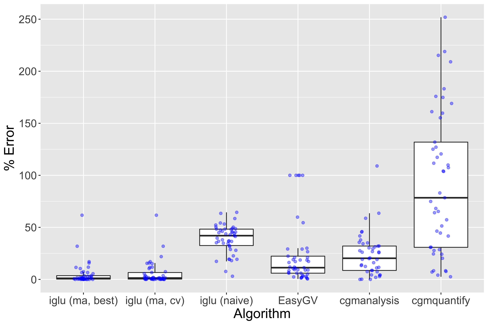

```{r setup, include = FALSE}
knitr::opts_chunk$set(
  collapse = TRUE,
  comment = "#>"
)
library(iglu)
```

Mean Amplitude of Glycemic Excursions (MAGE) is a glucose variability metric that can be applied to CGM data. From iglu version 3 onward, the package includes two algorithms for MAGE calculation: (i) version = 'ma' uses short and long moving averages to computationally emulate the original definition, (ii) version = 'naive' is a naive approximation included for backwards compatibility with earlier versions of iglu. The moving average algorithm was published in the Journal of Diabetes Science and Technology: [Open-source Algorithm to Calculate Mean Amplitude of Glycemic Excursions Using Short and Long Moving Averages](https://doi.org/10.1177/19322968211061165), and the code to reproduce all tests can be found at the accompanying repository:  [Nathaniel-Fernandes/mage_algorithm_data](https://github.com/Nathaniel-Fernandes/mage_algorithm_data). Below is a longer vignette describing the algorithm and the methods we used to test it. Some example code to help get started using MAGE in iglu is included in the [*Implementation*](#example_code) section.

# Abstract 

**Background**: Glucose variability is increasingly regarded as a risk factor for diabetes-related complications. The mean amplitude of glycemic excursions (MAGE) is a common measure of glucose variability. While its original definition requires manual calculations, there exist several software programs for automated calculations which have shown varying degrees of agreement. The objective of this study was to develop an automated algorithm for MAGE that would achieve high accuracy against the reference standard of manual calculations. 

**Methods**: Manual calculations of MAGE were performed on 45 publicly available CGM profiles from a diverse set of patients (e.g., type 1 diabetes, type 2 diabetes, and those without diabetes). An automated algorithm for MAGE calculation was developed to identify peaks and nadirs of glycemic excursions based on the crosses of a short and long moving average of the glucose profile, and implemented in version 3 of R package iglu. The accuracy of the algorithm was evaluated relative to manual calculations using a five-fold cross-validation and compared to four other publicly available MAGE calculators. 

**Results**: The newly developed algorithm had the median error of 1% relative to manual calculations. The median errors of the four other approaches including cgmanalysis, cgmquantify, EasyGV and algorithm in the earlier version of iglu were 20%, 78%, 11% and 42%, respectively. 

**Conclusions**: The newly developed algorithm eliminates the need for tedious manual MAGE calculations and approximates the manual derivation better than existing approaches. 

# Introduction 
Glucose variability is increasingly regarded as a risk factor for diabetes-related complications beyond HbA1c [1, 2]. The mean amplitude of glycemic excursions (MAGE) is a commonly used measure of glucose variability. As defined by Service et al. [3], MAGE is the arithmetic mean of the amplitude (i.e. height) of glucose excursions that are greater than the standard deviation of the glucose values. MAGE is calculated manually by visually inspecting the glucose profiles. However, such manual approach to calculating MAGE is error-prone and impractical for large datasets of continuous glucose monitors (CGMs). Thus, an automated algorithm for MAGE calculation that approximates the manual reference is needed. 

Several software programs for automated MAGE calculations have been developed, and these implementations can be divided into two categories: those that only return the numeric MAGE values, and those that additionally provide a visual display of the calculations [4]. Examples in the first category include the Excel®-based workbook EasyGV [5], online GlyCulator2 [6], R package cgmanalysis [7], early versions of R package iglu [8], and Python package cgmquantify [9]. Because these software programs do not output a visual display of the performed calculations, the user has no means to inspect the calculations and confirm accuracy. Examples in the second category include programs developed by Fritzsche [10] and Baghurst [11]. However, the software developed by Fritzsche are not compatible with newer operating systems (e.g., Windows 10) to allow importing of CGM data. According to documentation for cgmanalysis [7] and cgmquantify [9], these packages provide free implementations of Baghurst’s algorithm, albeit they may not fully reflect the original implementation. 

Comparison of GlyCulator, EasyGV, Fritzsche, and Baghurst algorithms demonstrates varying degrees of agreement across MAGE algorithms [12]. While the aforementioned algorithms were compared to each other, they were not compared with the manual reference standard. 

The objective of current study is to establish an approach of calculating MAGE that approximates well the results obtained manually. In developing an algorithm, the goal was to computationally emulate the manual method in Service et al. [3] based on the automated detection of peaks and nadirs tailored specifically towards CGM data, and to provide a freely available implementation with a visual display. To evaluate accuracy, the newly developed algorithm was compared with the manual derivations along with the other computational approaches. 

# Methods 
*CGM Data and Manual MAGE Calculation* 

Publicly available CGM data were obtained from [13], from which 45 CGM traces were selected to represent a diverse set of patients (type 1 diabetes, type 2 diabetes and those without diabetes), see Table 1. Each CGM trace corresponds to one day of measurements (24 h), where a day is defined from midnight to midnight as it is customary to calculate MAGE daily. Manual MAGE calculations were performed on each of the 45 CGM traces following the original description of MAGE calculations by Service et al. [3] by two of the authors, who were unaware of the outcome of new derived automated analysis. 

| Dataset      | Diabetes Type | Age group | Subject ID | Number of days used (CGM traces)
| ----------- | :-----------: | :-----------: | ----------- | :-----------: |
| [Hall et al. (2018)](https://doi.org/10.1371/journal.pbio.2005143)    | None       | Adults (> 18) | 1636-69-001 | 5|
|    |      |  | 1636-69-026 | 6|
| [Tsalikian et al. (2005)](https://doi.org/10.1016/j.jpeds.2005.04.065)   | Type 1       | Children (10 - 18) | 2 | 1|
|    |      |  | 7| 2|
|    |      |  | 8| 1|
|    |      |  | 11| 2|
|    |      |  | 15| 1|
|    |      |  | 43| 1|
|    |      |  | 44| 1|
| [Dubosson et al. (2005)](https://doi.org/10.1016/j.imu.2018.09.003)   | Type 1       | Adults (> 18)  | 1 | 5|
|    |      |  | 2| 2|
| [Broll et al. (2021)](https://doi.org/10.1371/journal.pone.0248560)   | Type 2       | Adults (> 18)  | Subject 1 | 1|
|    |      |  | Subject 2| 5|
|    |      |  | Subject 3| 1|
|    |      |  | Subject 4| 5|
|    |      |  | Subject 5| 6|

**Table 1:** Summary of the 45 CGM traces used for manual calculations. The first three datasets have been obtained as described in [13]. The last dataset is available within R package iglu [8].

&nbsp;
&nbsp;

*The Algorithm*

The original MAGE description in Service et al. [3] requires (i) identification of turning points (e.g., peaks and nadirs) for calculation of glucose excursions; (ii) calculation of the mean of excursion amplitudes (i.e., heights) by filtering only those that are above the threshold of one standard deviation. To the best of our knowledge, our implementations for both parts are unique. 

(i) Identification of peaks and nadirs. The proposed algorithm uses the crosses of short and long moving averages to identify time intervals where a peak or nadir may exist. Let $\alpha$ be the window size for the short moving average, and 𝛽 be the window size for the long moving average, where $\alpha < \beta$. A peak or nadir must exist on the intervals that are bounded by the crosses of the two moving averages as demonstrated in Figure 1. This occurs because the shorter moving average is more affected by the local variation in the glucose values than the longer moving average. The glucose value at a peak or nadir (i.e., $p_i$) is then determined as the maximum or minimum glucose value, respectively, between the two crossing points. By default, the first and last glucose values are always treated as turning points. A distinct advantage of using moving averages to identify the turning points is that they inherently smooth out local fluctuations and noise within larger trends in a glucose profile. The amount of smoothing can be tuned by varying window size parameters $\alpha$ and $\beta$. By default, the algorithm uses $\alpha = 5$ and $\beta = 32$ as these values lead to high accuracy when compared to the manual MAGE calculations. 

(ii) Eliminating Excursions and Calculation of Mean Amplitudes. Given the glucose values $p_i$ at the turning points (either peaks or nadirs), the amplitude of an excursion is calculated as |$p_{i + 1}-p_i$|. The amplitude value corresponds to the ascending segment if $p_i$ corresponds to a nadir, and to the descending segment if $p_i$ corresponds to a peak. First, we check whether the amplitudes exceed one standard deviation threshold. If an amplitude value is below the threshold, the algorithm will skip the corresponding turning points, and recalculate the amplitudes based on the remaining $p_i$ (this allows to absorb a smaller excursion within a larger excursion). Secondly, to prevent double counting excursions, only ascending (MAGE+) or descending (MAGE–) excursion amplitudes are averaged. When excursions are symmetric, MAGE+ = MAGE–, however in general they may disagree [11]. By default, the algorithm follows the description in Service et al. [3], and calculates MAGE+ or MAGE– depending on which type of excursion first crosses the one SD threshold.  

<a name="example_code"></a>   
*Implementation*   
The newly developed algorithm for MAGE calculation can be found from version 3 onward in R package iglu [17] as well as the accompanying GUI via Shiny App [8] - both are free and open-source. Implementation in a script-based programming language like R allows the creation of reproducible scripts for all data processing and MAGE calculation steps, and the availability of a point-and-click GUI meets the needs of researchers with limited programming experience. By default, the algorithm uses   $\alpha = 5$ and $\beta = 32$, however these choices can be adjusted by the user. 

```{r mage example, message = FALSE, warning=FALSE}
# load package and example data
library(iglu)
# mage calculation using default parameters
mage(example_data_5_subject)
# Adjust default window sizes in mage calculation
mage(example_data_5_subject, short_ma = 3, long_ma = 30)
```

In addition to providing a numerical MAGE value, the software allows the creation of glucose trace plots that highlight the selected peaks and nadirs used for MAGE calculation.

```{r figure 1, fig.height=5, fig.width=7}
# subset data to better see identified peaks and nadirs
fig1data <- example_data_1_subject[1:200, ]
# plot using mage function with plot = TRUE and show_ma = TRUE 
mage(fig1data, plot = TRUE, show_ma = TRUE, title = "Glucose Trace - Subject 1")
```
**Figure 1:** Glucose trace of Subject 2 with Type 2 diabetes from Broll et al. [8], the solid green line is a short MA with $\alpha$ = 5 and the solid orange line is a long MA with $\beta$ = 32. The peaks and nadirs occur between the crosses of short and long moving averages. By default, the algorithm calculates MAGE+ as in this profile the first segment to exceed one SD threshold is ascending. The provided graphical display in iglu software [17] automatically highlights only those peaks (red) and nadirs (blue) that are used for final calculation. 

&nbsp;
&nbsp;

Additionally, the plot will highlight any gaps in the data due to missing readings.

```{r figure 2, fig.width=7, fig.height=5}
# subset data to better show gaps
fig2data <- example_data_1_subject[200:400, ]
# plot using mage function with plot = TRUE
mage(fig2data, plot = TRUE, title = "Glucose Trace with Gaps - Subject 1")
```
**Figure 2**. Glucose trace of Subject 5 with Type 2 diabetes from Broll et al. [8] with regions of missing glucose readings automatically highlighted using iglu software [17]. 

&nbsp;
&nbsp;

*Assessment of Accuracy*   
The accuracy of the proposed algorithm was evaluated against 45 manual calculations. For each CGM trace, the accuracy was measured as the relative percent difference in the automatically calculated MAGE value and the manual MAGE value, that is: |MAGEalgorithm - MAGEmanual|/MAGEmanual⋅ 100%. 

To find optimal combination of window sizes, we considered $\alpha \in [1, 15]$ and $\beta \in [16, 38]$, and recorded the mean errors across 45 CGM traces for each pair of ($\alpha, \beta$) values. The optimal ($\alpha, \beta$) pair was determined as the one that leads to the minimal in-sample error. Since the obtained minimal error is a biased assessment of accuracy as the optimal ($\alpha, \beta$) were selected based on the same 45 traces, unbiased assessment of accuracy using five-fold cross-validation was also performed. The 45 CGM traces were randomly split into five groups of nine samples each. The best ($\alpha, \beta$) combination was then chosen using the four out of five groups, and used to evaluate the accuracy on the remaining group. The best combination was defined as the one that gave the lowest percent error compared to manual calculations. This out-of-sample evaluation was performed on all five groups. 

The accuracy of EasyGV [5], cgmanalysis [7], cgmquantify [9], and the MAGE algorithm implemented in the earlier version of iglu [8] was also determined against the manual reference derivation. The latter is a naive simplification of original MAGE definition, as it calculates MAGE as the mean of absolute differences between glucose values and the glucose mean that are larger than one standard deviations (and thus does not attempt to explicitly identify peaks and nadirs). We use iglu_ma to denote the proposed algorithm based on moving averages, and iglu_naive to denote the naive algorithm used in earlier versions of the software. We were unable to evaluate GlyCulator2 [6] because the software requires CGM trace to have at least 576 time points, and thus returns NA when applied to 24-hour CGM data. We were also unable to evaluate Fritzsche [10] as importing the CGM data into the provided user interface on Windows 10 lead to errors. 

# Results 

The optimal choice of window sizes ($\alpha, \beta$) for the proposed algorithm was determined to be (5, 32) as this combination minimized the average error relative to 45 manual calculations. Figure 3 shows a heatmap of the percent average error (across 45 traces) as a function of $\alpha$ and $\beta$, where the darkest regions represent the most favorable combinations of $\alpha$ and $\beta$. The minimum corresponds to the average error of 4.8%. The corresponding median relative error was much smaller, 1.1%, with the inter-quartile range of [0.3%, 3.6%]. As expected, the out-of-sample cross-validated errors were larger, but still relatively low. The average cross-validated error was 5.8%, with the median of 1.3% and inter-quartile range of [0.3%, 6.6%]. 

```{r, echo=FALSE, fig.width=10, fig.height=7, out.width="700px", out.height ="400px"}
knitr::include_graphics("mage_figures/Figure3_heatmap_percent_error.png")
```
**Figure 3.** Heatmap of average errors over 45 CGM traces of automatically calculated MAGE values via proposed algorithm relative to manual MAGE values. The short moving average window size $\alpha \in [1, 15]$ and the long moving average window size $\beta \in [16, 38]$. The darker regions correspond to smaller errors, with the minimal error of 4.8% achieved at $\alpha = 5$, $\beta = 32$. 

&nbsp;
&nbsp;

Compared to the other available automated algorithms, the next best results were achieved by EasyGV, which had an average error of 23.4%, the median error of 11.3% and the IQR of [6.0%, 22.3%]. In constrast, cgmanalysis, iglu_naive, and cgmquantify all had significantly higher errors, with median errors (and interquartile range) of 20.3% [8.6%, 32.1%], 42.0% [32.6%, 48.3%], and 78.4% [30.8%, 131.9%], respectively. Figure 4 shows boxplots of relative errors of all algorithms on 45 CGM traces. 

```{r, echo=FALSE, fig.width=10, fig.height=7, out.width="700px", out.height ="400px"}

```

**Figure 4.** Comparison of relative errors of different automatic algorithms for MAGE calculation relative to manual MAGE values on 45 CGM traces. The proposed method is implemented as ma (moving average) algorithm in R package iglu [17]; best corresponds to the errors with $\alpha = 5$, $\beta = 32$; cv corresponds to the out-of-sample errors based on 5- fold-cross-validation for $\alpha, \beta$. 

&nbsp;
&nbsp;

For the proposed algorithm, both in-sample errors with the best choice of window sizes ($\alpha, \beta$) and out-of-sample cross-validated errors are displayed. The corresponding numerical summaries are summarized in Table 2. 


|Algorithm        | Mean  | Median | IQR           |
|:----------------|:------|:-------|:--------------|
| iglu (ma, best) | 4.9%  | 1.1%   | [0.3%, 3.6%]  |
| iglu (ma, cv)   | 5.8%  | 1.3%   | [0.3%, 6.6%]  |
| iglu (naive)    | 39.0% | 42.0%  | [32.6%, 48.3%]|
| EasyGV          | 23.4% | 11.3%  | [6.0%, 22.3%] |
| cgmanalysis     | 23.9% | 20.3%  | [8.6%, 32.1%] |
| cgmquantify     | 91.9% | 78.4%  |[30.8%, 131.9%]|

**Table 2:** Numerical summaries of relative errors of automatic MAGE calculators on 45 CGM traces compared to manual calculations. The proposed method is implemented as ma (moving average) algorithm in R package iglu [17]; best corresponds to the errors with $\alpha$ = 5, $\beta$ = 32; cv corresponds to the out-of-sample errors based on 5-fold-cross-validation for $\alpha$, $\beta$.

&nbsp;
&nbsp;

# Discussion 

There are several software programs for automatic MAGE calculation, however, they show varying agreement [12]. In the current study, a new automated algorithm for MAGE was developed based on moving averages which demonstrated the least amount of error relative to manual reference when compared to other automated algorithms. 

The newly developed algorithm approximated the manual results better than EasyGV, cgmanalysis, iglu_naive, and cgmquantify. The largest discrepancy was noted for cgmanalysis and cgmquantify both of which implemented Baghurst’s algorithm [11]. It is unclear whether the deviation from manual determination is due to the underlying algorithm or the specifics of implementation of the algorithm. The differences in accuracy among the MAGE algorithms points to the necessity of a visual display of the underlying calculations with identified peaks and nadirs. While such visual display is implemented for the proposed MAGE algorithm in version 3 of R package iglu [17], this functionality is absent from EasyGV, cgmanalysis, and cgmquantify, making it more difficult for the user to verify the accuracy. 

A major challenge for any automated MAGE algorithm is separation of true peaks and nadirs in a larger trend from the smaller glucose fluctuations. A particular advantage of the proposed algorithm is the use of moving averages which inherently smooth out local fluctuations within a larger trend. The amount of smoothing can be tuned by varying the window sizes of the short and long moving averages, and we found that the algorithm is quite robust to the choice of window sizes, with high accuracy in a large range (Figure 3). One disadvantage is that the moving average is a lagging indicator, and thus is undefined in the beginning of the time period (e.g., a moving average of window size 20 is undefined for the first 19 time points). This could skew the calculations of MAGE if the first times points contain a lot of variation in subject’s glucose levels. To adjust for this, the algorithm replaces the undefined moving average values at the first time points with the first calculated moving average value (e.g., a moving average of window size 20 will be first calculated at 20th time point, and that same value will be assigned to the first 19 time point to be later used in determining the crosses of short and long moving averages). This adjustment can be seen for the long moving average in Figure 1, where its value is flat for the first 32 points. Given the high accuracy of the proposed algorithm compared to manual calculations, this adjustment is adequate, however it is possible that it may not be adequate for some CGM profiles. In practice, we recommend to inspect the visual display of MAGE calculations provided by iglu [17] as in Figures 1 and 2 for additional accuracy validation. Another challenge for MAGE calculations is the presence of asymmetric excursions. To prevent double counting, typically only ascending (MAGE+) or descending (MAGE–) excursion amplitudes are averaged. When excursions are symmetric, MAGE+ = MAGE–, and the accuracy is not affected irrespective of the choice of direction. However, when excursions are asymmetric, the direction matters as the two disagree. By default, our algorithm follows the description in Service et al. [3], and calculates MAGE+ or MAGE– depending on which type of excursion first crosses the one SD threshold. The same decision is made in [12]. However, Baghurst [11] argues that it is more appropriate to use MAGEavg = (MAGE+ + MAGE–)/2. Our implementation allows the user to change the default settings, and explicitly calculate MAGE+, MAGE–, or MAGEavg, which makes our algorithm’s implementation more flexible compared to existing MAGE software. 

# Conclusion 

A new algorithm for MAGE calculation that significantly outperforms existing algorithms in terms of accuracy is presented. The implementation of this algorithm is free and open-source, it is available in the R package iglu version 3 [17] as well as in the accompanying GUI via Shiny App at https://irinagain.shinyapps.io/shiny_iglu/. Furthermore, the visual displays of the CGM traces, exact values for manual MAGE and the code to reproduce all analyses, along with instructions on how to download each CGM trace, are publicly available at https://github.com/Nathaniel-Fernandes/mage_algorithm_data. The public nature of CGM traces, manual MAGE values, and the algorithm allow additional validation of presented results by a community at large. 

**Funding Sources**: NSF CAREER Award DMS-2044823 to IG 

**Acknowledgements**: The source of subset of the data is the T1D Exchange, but the analyses, content and conclusions presented herein are solely the responsibility of the authors and have not been reviewed or approved by the T1D Exchange. 

**Disclosures**: None  

# References 

[1]	Kovatchev BP. Metrics for glycemic control—from HbA1c to continuous glucose monitoring. Nature Reviews Endocrinology. 2017 Jul;13(7):425-36. 

[2]	Service FJ. Glucose variability. Diabetes. 2013 May;62(5):1398-404. 

[3]	Service FJ, Molnar GD, Rosevear JW, Ackerman E, Gatewood LC, Taylor WF. Mean amplitude of glycemic excursions, a measure of diabetic instability. Diabetes. 1970 Sep 1;19(9):644-55. 

[4]	Yu X, Lin L, Shen J, Chen Z, Jian J, Li B, Xin SX. Calculating the mean amplitude of glycemic excursions from continuous glucose data using an open-code programmable algorithm based on the integer nonlinear method. Computational and mathematical methods in medicine. 2018 Mar 8;2018. 

[5]	Hill NR, Oliver NS, Choudhary P, Levy JC, Hindmarsh P, Matthews DR. Normal reference range for mean tissue glucose and glycemic variability derived from continuous glucose monitoring for subjects without diabetes in different ethnic groups. Diabetes technology & therapeutics. 2011 Sep 1;13(9):921-8. 

[6]	Pagacz K, Stawiski K, Szadkowska A, Mlynarski W, Fendler W. GlyCulator2: an update on a web application for calculation of glycemic variability indices. Acta diabetologica. 2018 Aug;55(8):877-80. <!--https://apps.konsta.com.pl/app/glyculator/ Date Accessed: March 11, 2021. -->

[7]	Vigers T, Chan CL, Snell-Bergeon J, Bjornstad P, Zeitler PS, Forlenza G, Pyle L. cgmanalysis: an R package for descriptive analysis of continuous glucose monitor data. Plos one. 2019 Oct 11;14(10):e0216851. 

[8]	Broll S, Urbanek J, Buchanan D, Chun E, Muschelli J, Punjabi NM, Gaynanova I. Interpreting blood GLUcose data with R package iglu. Plos one. 2021 Apr 1;16(4):e0248560. 

[9]	Bent B. cgmquantify: python package for analyzing glucose and glucose variability. Python package version 0.5. 2020 Nov 11. https://github.com/brinnaebent/cgmquantify Date Accessed: March 11, 2021. 

[10]	Fritzsche G, Kohnert KD, Heinke P, Vogt L, Salzsieder E. The use of a computer program to calculate the mean amplitude of glycemic excursions. Diabetes technology & therapeutics. 2011 Mar 1;13(3):319-25 

[11]	Baghurst PA. Calculating the mean amplitude of glycemic excursion from continuous glucose monitoring data: an automated algorithm. Diabetes technology & therapeutics. 2011 Mar 1;13(3):296-302. 

[12]	Sechterberger MK, Luijf YM, DeVries JH. Poor agreement of computerized calculators for mean amplitude of glycemic excursions. Diabetes technology & therapeutics. 2014 Feb 1;16(2):72-5. 

[13]	Martin M, Chun E, Buchanan D, Bhat R, Cass S, Wang E, Senthil S, Gaynanova I. irinagain/Awesome-CGM: List of public CGM datasets (Version v1.1.0). 2021, April 27. https://github.com/irinagain/Awesome-CGM Date Accessed: May 1, 2021. 

[14]	Hall H, Perelman D, Breschi A, Limcaoco P, Kellogg R, McLaughlin T, Snyder M. Glucotypes reveal new patterns of glucose dysregulation. PLoS biology. 2018 Jul 24;16(7):e2005143. 

[15]	Tsalikian E, Mauras N, Beck RW, Tamborlane WV, Janz KF, Chase HP, Wysocki T, Weinzimer SA, Buckingham BA,  Kollman C, Xing D. Impact  of exercise on overnight glycemic control in children with type 1 diabetes mellitus. The Journal of pediatrics. 2005 Oct;147(4):528-34. 

[16]	Dubosson F, Ranvier JE, Bromuri S, Calbimonte JP, Ruiz J, Schumacher M. The open D1NAMO dataset: A multi-modal dataset for research on non-invasive type 1 diabetes management. Informatics in Medicine Unlocked. 2018 Jan 1;13:92-100. 

[17]	Broll S, Buchanan D, Chun E, Muschelli J, Fernandes N, Seo J, Shih J, Urbanek J, Schwenck J, Gaynanova I. iglu: Interpreting Glucose Data from Continuous Glucose Monitors. R package version 3.0.0. 2021 July 23. https://cran.r-project.org/package=iglu. Date Accessed: July 23, 2021.
