The iglu package is developed to assist the analyses of data from Continuous Glucose Monitors (CGMs). CGMs are small wearable devices that measure the glucose levels continuously throughout the day, with some monitors taking measurements as often as every 5 minutes. Data from these monitors provide a detailed quantification of the variation in blood glucose levels during the course of the day, and thus CGMs play an increasing role in clinical practice. For more on CGMs, see [Rodbard (2016) "Continuous Glucose Monitoring: A Review of Successes, Challenges, and Opportunities."](https://doi.org/10.1089/dia.2015.0417).

Multiple CGM-derived metrics have been developed to assess the quality of glycemic control and glycemic variability, many of which are summarized in [Rodbard (2009) "Interpretation of continuous glucose monitoring data: glycemic variability and quality of glycemic control."](https://www.ncbi.nlm.nih.gov/pubmed/19469679). The iglu package streamlines the calculation of these metrics by providing clearly named functions that output metrics values with one line of code. 

The iglu package is designed with the following three components of Continuous Glucose Monitor (CGM) data in mind:

* Blood glucose level measurement [in mg/dL]

* Timestamp for glucose measurement

* Subject identification

The iglu package comes with example data from 5 subjects with Type II diabetes whose glucose levels were measured using Dexcom G4 CGM.  


## Example data for 1 subject

Example data with 1 subject can be loaded with:


```r
data("example_data_1_subject")
```
  
This dataset contains 2915 observations of 3 columns corresponding to the three components listed in the introduction:

* `"id"` - Factor (character string) column for subject identification
* `"time"` - Factor (character string) column that can be converted to DateTime for measurement timestamp
* `"gl"` - Numeric column for glucose measurement

Data used with iglu functions may have additional columns, but the columns for id, time and glucose values must be named as above.


```r
dim(example_data_1_subject)
#> [1] 2915    3
str(example_data_1_subject)
#> 'data.frame':	2915 obs. of  3 variables:
#>  $ id  : Factor w/ 1 level "Subject 1": 1 1 1 1 1 1 1 1 1 1 ...
#>  $ time: POSIXct, format: "2015-06-06 16:50:27" "2015-06-06 17:05:27" ...
#>  $ gl  : int  153 137 128 121 120 138 155 159 154 152 ...
head(example_data_1_subject)
#>          id                time  gl
#> 1 Subject 1 2015-06-06 16:50:27 153
#> 2 Subject 1 2015-06-06 17:05:27 137
#> 3 Subject 1 2015-06-06 17:10:27 128
#> 4 Subject 1 2015-06-06 17:15:28 121
#> 5 Subject 1 2015-06-06 17:25:27 120
#> 6 Subject 1 2015-06-06 17:45:27 138
```

## Example data for 5 subjects

Example data with multiple subjects can be loaded with:


```r
data("example_data_5_subject")
```
  
This dataset contains the same 3 columns as the dataset in the single subject case, but now with 13866 observations from 5 subjects. The first subject in this multiple subject dataset is the same as the single subject from the previous examples.


```r
dim(example_data_5_subject)
#> [1] 13866     3
str(example_data_5_subject)
#> 'data.frame':	13866 obs. of  3 variables:
#>  $ id  : Factor w/ 5 levels "Subject 1","Subject 2",..: 1 1 1 1 1 1 1 1 1 1 ...
#>  $ time: POSIXct, format: "2015-06-06 16:50:27" "2015-06-06 17:05:27" ...
#>  $ gl  : int  153 137 128 121 120 138 155 159 154 152 ...
```

# Calculating time-independent metrics

Time-independent metrics do not use any linear interpolation because the time component of the data is not used in their calculations. Because the time component is not necessary, when working with a single subject only a glucose vector is required. If a glucose vector for multiple subjects is supplied, or if a dataframe that doesn't have all three columns is supplied, these functions will treat all glucose values as though they are from the same subject.

## Example metrics

All metric functions in iglu will produce the output in a tibble form. See documentation on tibbles with vignette('tibble') or ?`tbl_df-class`.

Some metric functions, like `above_percent()`, will return multiple values for a single subject. 


```r
above_percent(example_data_1_subject)
#> # A tibble: 1 x 5
#>   id        above_140 above_180 above_200 above_250
#>   <fct>         <dbl>     <dbl>     <dbl>     <dbl>
#> 1 Subject 1      26.7      8.40      3.70     0.446
```

When a dataframe is passed, subject id will always be printed in the id column, and metrics will be printed in the following columns. 

As discussed above, just the glucose vector can be supplied for the single subject case. 


```r
above_percent(example_data_1_subject$gl)
#> # A tibble: 1 x 4
#>   above_140 above_180 above_200 above_250
#>       <dbl>     <dbl>     <dbl>     <dbl>
#> 1      26.7      8.40      3.70     0.446
```

However, it is not recommended to pass just glucose values whenever the time and subject are also available, because this output will not contain the subject ID. 

The list of target values for the above_percent metric is a parameter that can be changed:


```r
above_percent(example_data_1_subject, targets = c(100, 200, 300))
#> # A tibble: 1 x 4
#>   id        above_100 above_200 above_300
#>   <fct>         <dbl>     <dbl>     <dbl>
#> 1 Subject 1      74.4      3.70         0
```

Many metrics have parameters that can be changed. To see available parameters for a given metric, see the documentation i.e. ?above_percent or help(above_percent).  

Not all metric functions return multiple values. Many, like `MAGE()` (Mean Amplitude of Glycemic Excursions), will return just a single value for each subject, producing a column for value and a column for subject id (if a dataframe is passed), as well as a row for each subject.


```r
mage(example_data_5_subject)
#> # A tibble: 5 x 2
#>   id         mage
#>   <fct>     <dbl>
#> 1 Subject 1  53.4
#> 2 Subject 2  78.2
#> 3 Subject 3  76.6
#> 4 Subject 4  42.9
#> 5 Subject 5  90.0
```


# Calculating time-dependent metrics

## CGMS2DayByDay()
Observe that the timestamps in the first rows are not evenly spaced. Linear interpolation is used where appropriate for computation of metrics that require a time component with equally spaced measurements. Time intervals within large gaps between variables will not be interpolated, but instead will be treated as missing values. 

Functions requiring linear interpolation call the `CGMS2DayByDay()` function on the data automatically. This function can be explicitly called by the user to test on their datasets. Note that this function is only designed for one subject at a time. Below we will look at the structure of this functions output.


```r
str(CGMS2DayByDay(example_data_1_subject))
#> List of 3
#>  $ gd2d        : num [1:14, 1:288] NA 112.2 92 90.1 143.1 ...
#>  $ actual_dates: Date[1:14], format: "2015-06-06" "2015-06-07" ...
#>  $ dt0         : num 5
```

The first part of the output, gd2d, is the interpolated grid of values. The function determined that the frequency of the measurements for this sensor was 5 minutes, so for each of the 14 days (the rows) there are 288 columns (the 5 minute intervals). The second part of the output, actual_dates, is a vector of dates corresponding to the ros in the gd2d output. The final part is just the dt0, parameter, which is detected automatically but can also be specified.


```r
str(CGMS2DayByDay(example_data_1_subject, dt0 = 10))
#> List of 3
#>  $ gd2d        : num [1:14, 1:144] NA 111.1 92.9 89.1 138.2 ...
#>  $ actual_dates: Date[1:14], format: "2015-06-06" "2015-06-07" ...
#>  $ dt0         : num 10
```
Note that the final part of the output reflects our input, and there are now only 144 columns instead of 288.

The CGMS2DayByDay function also allows specification of the maximum allowable gap to interpolate values across (default is 45 minutes) and a string corresponding to time zone (default is the timezone of the user's system). 

All functions for metrics requiring linear interpolation will accept the following three parameters that are passed on to `CGMS2DayByDay()`:

* "`dt0`" - Time frequency (numeric) for interpolation. Default will automatically match the frequency of the data
* "`inter_gap`" - Maximum allowable gap in minutes (numeric) for interpolation
* "`tz`" - String corresponding to timezone where the data's measurements were recorded
  
In the example_data_5_subject dataset, it is important to specify `tz` = 'EST', because a Daylight Savings Time shift can cause miscalculations if the wrong timezone is used. A proper call for this dataset, being recorded in EST, would be: 


```r
CGMS2DayByDay(example_data_1_subject, tz = 'EST')
```

Examples of proper metric function calls will be shown in the next section.

## Example metrics

Need to add references to 'tz' in these examples.

Some metric functions, like `conga()` (Continuous Overlapping Net Glycemic Action), will return just a single value for each subject,
resulting in a 2 column tibble (1 column for id and 1 for the single value).


```r
conga(example_data_1_subject, tz = 'EST')
#> # A tibble: 1 x 2
#>   id        conga
#>   <fct>     <dbl>
#> 1 Subject 1  37.0
```

Note that even though we are working with a single subject, a dataframe with glucose values, time, and subject id's must be passed. Functions for metrics requiring the time component for calculation can not be passed a vector of glucose values.

`sd_measures()`, which computes 6 unique standard deviation subtypes, requires linear interpolation and returns multiple values for each subject.


```r
sd_measures(example_data_5_subject)
#> # A tibble: 5 x 7
#>   id          SdW SdHHMM SdWSH  SdDM   SdB SdBDM
#>   <fct>     <dbl>  <dbl> <dbl> <dbl> <dbl> <dbl>
#> 1 Subject 1  26.4   19.6  6.54  16.7  27.9  24.0
#> 2 Subject 2  36.7   22.8  7.62  52.0  48.0  35.9
#> 3 Subject 3  42.9   14.4  9.51  12.4  42.8  42.5
#> 4 Subject 4  24.5   12.9  6.72  16.9  25.5  22.0
#> 5 Subject 5  50.0   29.6 12.8   23.3  50.3  45.9
```


# Visualizations

The iglu package currently supports 3 plot types:

* Time series plot
* Unsorted lasagna plot
* Row sorted lasagna plot

The time series plot is the default type for the function `plot_glu`. This plot type can support both single and multiple subjects.


```r
plot_glu(example_data_1_subject, plottype = 'tsplot', tz = "EST")
```

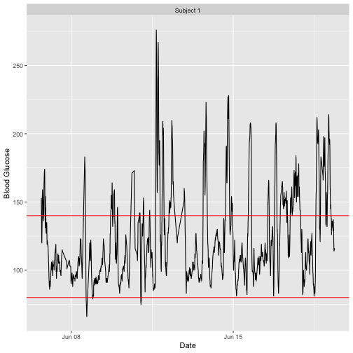

```r
plot_glu(example_data_5_subject, plottype = 'tsplot', tz = "EST")
```

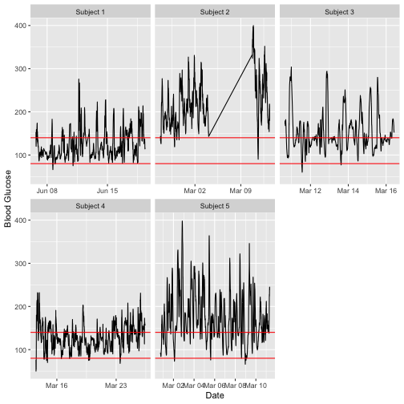

We set the 'tz' (timezone) parameter to be EST because the data was collected in the eastern time zone. If left blank, the time zone used for plotting will be the system's time zone. Time zone is mainly an issue in cases where daylight savings time might make it appear as though there were duplicate values at some time points.

To just plot a single subject of interest from the grid of time series plots, set the 'subjects' parameter to be that subject's ID.


```r
plot_glu(example_data_5_subject, plottype = 'tsplot', subjects = 'Subject 3', tz = "EST")
```

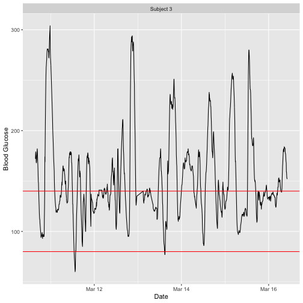

The red lines can be shifted to any Lower and Upper Target Range Limits with the 'LLTR' and 'ULTR' arguments.


```r
plot_glu(example_data_5_subject, plottype = 'tsplot', subjects = 'Subject 3', LLTR = 80, ULTR = 150, tz = "EST")
```

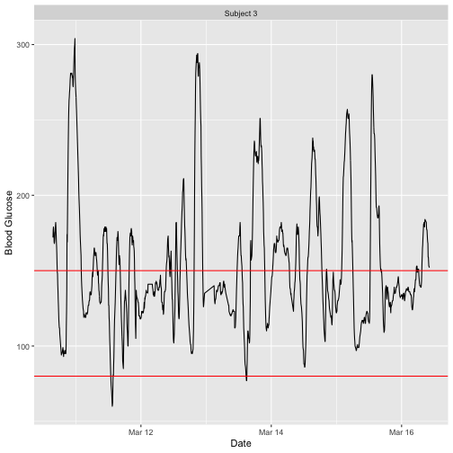

The `plot_glu` function also supports lasagna plots by changing the 'plottype' parameter. For more on lasagna plots, see [Swihart et al. (2010) "Lasagna Plots: A Saucy Alternative to Spaghetti Plots." ](https://doi.org/10.1097/ede.0b013e3181e5b06a)


```r
plot_glu(example_data_5_subject, plottype = 'lasagna', tz = 'EST')
```

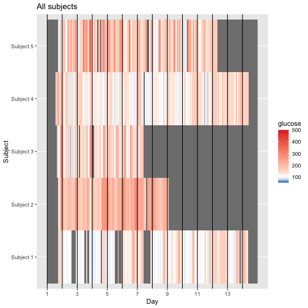

By default, this will produce an unsorted lasagna plot using up to 14 days worth of data displayed separately. To average across days at each time point, we can use `datatype = 'average'`:


```r
plot_glu(example_data_5_subject, plottype = 'lasagna', datatype = 'average', tz = 'EST')
```

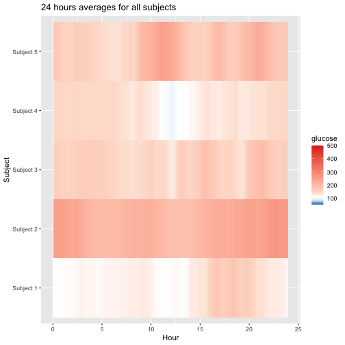

We can additionally sort the values at each time point across the five subjects by setting `lasagnatype = 'timesorted'`


```r
plot_glu(example_data_5_subject, plottype = 'lasagna', datatype = 'average', lasagnatype = 'timesorted', tz = 'EST')
```

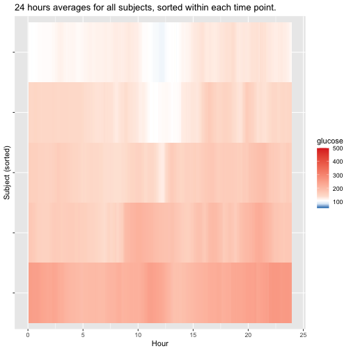

When working with a single subject, setting `datatype = single` will produce plots where rows represent days instead of subjects.


```r
plot_glu(example_data_1_subject, plottype = 'lasagna', datatype = 'single', lasagnatype = 'unsorted', tz = 'EST')
```

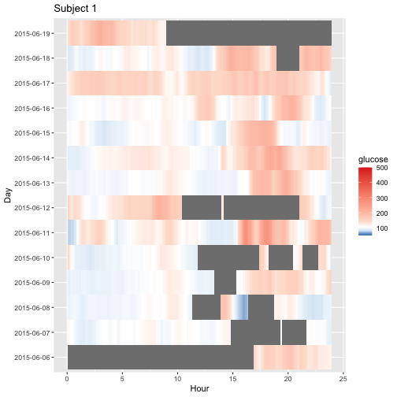


```r
plot_glu(example_data_1_subject, plottype = 'lasagna', datatype = 'single', lasagnatype = 'timesorted', tz = 'EST')
```

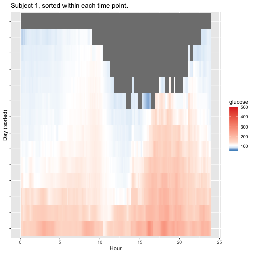

For further customization of lasagna plots, use the `plot_lasagna` and `plot_lasagna_1subject` functions. 

`plot_lasagna` allows for multi-subject lasagna plots with the additional options of sorting the hours by glucose values for each subject, i.e. horizontal sorting, by setting
`lasagnatype = 'subjectsorted'`.


```r
plot_lasagna(example_data_5_subject, datatype = 'average', lasagnatype = 'subjectsorted', tz = 'EST')
```

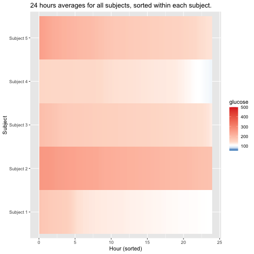

`plot_lasagna` also supports changing the maximum number of days to display, as well as the upper and lower target range limits (LLTR and ULTR), midpoint, and minimum and maximum values to display, all of which will affect the colorbar.


```r
plot_lasagna(example_data_5_subject, datatype = 'average', lasagnatype = 'subjectsorted', LLTR = 100, ULTR = 180, midpoint = 150, limits = c(80, 500), tz = 'EST')
```

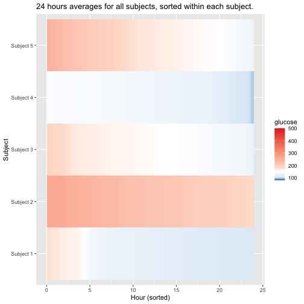

`plot_lasagna_1subject` allows for customization of the more detailed single subject lasagna plots. There is no datatype parameter for `plot_lasagna_1subject`, but there are three types of plots available, accessed with the `lasagnatype` parameter.


```r
plot_lasagna_1subject(example_data_1_subject, lasagnatype = 'unsorted', tz = 'EST')
```


```r
plot_lasagna_1subject(example_data_1_subject, lasagnatype = 'timesorted', tz = 'EST')
```


```r
plot_lasagna_1subject(example_data_1_subject, lasagnatype = 'daysorted', tz = 'EST')
```

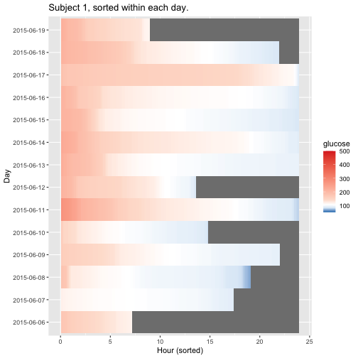

As with the `lasagna_plot` function, changing the LLTR, ULTR, midpoint, and limits parameters will affect the colorbar.


```r
plot_lasagna_1subject(example_data_1_subject, lasagnatype = 'daysorted', midpoint = 150, limits = c(80,500), tz = 'EST')
#> Warning in regularize.values(x, y, ties, missing(ties), na.rm = na.rm):
#> collapsing to unique 'x' values

#> Warning in regularize.values(x, y, ties, missing(ties), na.rm = na.rm):
#> collapsing to unique 'x' values

#> Warning in regularize.values(x, y, ties, missing(ties), na.rm = na.rm):
#> collapsing to unique 'x' values
```

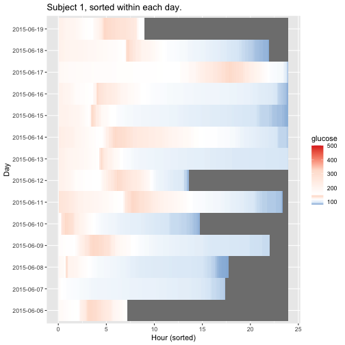

# Shiny App

The iglu package comes with a shiny app containing all of the metric calculations as well as all plot types of the package itself.
  
The full app can be accessed by running `iglu::iglu_shiny()` (iglu must be installed to use the `iglu_shiny` function).
  
The app itself has a demo available at [https://stevebroll.shinyapps.io/shinyigludemo/](https://stevebroll.shinyapps.io/shinyigludemo/) with data pre-loaded.
